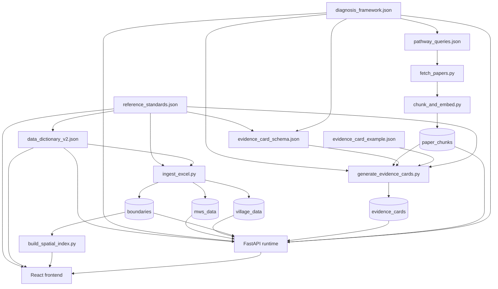

# Artifact Relationships & Data Flow

Reference diagram from README, expanded with implementation notes.

---

## Dependency Graph



---

## Collection → Consumer Matrix

| MongoDB Collection | Written by | Read by |
|--------------------|-----------|---------|
| `mws_data` | ingest_excel | /api/mws, assembler, code-act |
| `village_data` | ingest_excel | /api/village, code-act |
| `mws_boundaries` | ingest_excel | /api/map/mws, /api/locate, code-act |
| `village_boundaries` | ingest_excel | /api/map/villages, code-act |
| `tehsil_boundaries` | ingest_excel | build_spatial_index |
| `ingest_manifest` | ingest_excel | Frontend tehsil availability check |
| `paper_chunks` | chunk_and_embed | retriever (citations) |
| `evidence_cards` | generate_evidence_cards | retriever (diagnosis) |
| `diagnosis_framework` | manual load | assembler, reasoner |
| `data_dictionary` | manual load | assembler, chartSpec |
| `sessions` | session_manager | /api/query, /api/answer |

---

## Standards Cross-Reference

### NBSS-LUP AER (AER-1 .. AER-20)

- **Defined in:** `reference_standards.json → nbss_lup_agro_ecological_regions`
- **Used in:** evidence card context, MWS agroecological assignment, AER-from-text in card generation
- **Darwha context:** AER-6 (Deccan Plateau, hot semi-arid, volcanic aquifer)

### ACWADAM Aquifer Types (6 classes)

- **Defined in:** `reference_standards.json → acwadam_aquifer_types`
- **Used in:** ingest aquifer mapping, evidence card aquifer_tags filter, vector search pre-filter
- **Enum:** alluvium | himalayan_and_sub_himalayan | volcanic | sedimentary_soft_rock | sedimentary_hard_rock | crystalline_basement

### Rainfall Regime (5 bands)

- **Defined in:** `reference_standards.json → rainfall_regime_ranges`
- **Bands:** arid (<740), semi-arid (740–960), sub-humid (960–1200), humid (1200–1620), perhumid (>1620 mm)

### Agricultural Year Convention

- **Defined in:** `data_dictionary_v2.json → agricultural_year_convention`
- **Rule:** Integer key = start year of Jul 1 – Jun 30 cycle (2017 = 2017-18)

---

## Diagnosis Framework Hierarchy

```
Production System (4)
  └── Observed Stress (10)
        └── Causal Pathway (33)
              ├── diagnostic_variables[] → data_dictionary_v2.json
              ├── solutions[]
              └── evidence_cards[] → generated from papers
```

**Production systems:** Agriculture, Livestock, NTFP_Forest_Biodiversity, Fishery, Socio_Economic

**Example pathway chain:**
```
Agriculture → water_scarcity → groundwater_stress
  → variables: soge_dev_percent, annual_well_depth_m, annual_delta_g_mm, ...
  → solutions: SWC works, check dams, groundwater governance, ...
  → evidence card: agriculture__water_scarcity__groundwater_stress__001
```

---

## Evidence Card Structure (summary)

Required fields per `evidence_card_schema.json`:

| Field | Purpose |
|-------|---------|
| `card_id` | Unique ID: `{system}__{stress}__{pathway}__{NNN}` |
| `production_system`, `observed_stress`, `causal_pathway` | Framework linkage |
| `context` | agro_climatic_zones, aquifer_types, terrain_types, rainfall_regime |
| `diagnostic_signals[]` | Quantitative/trend/qualitative conditions on variables |
| `confounders[]` | Alternative explanations + how to distinguish |
| `missing_variable_questions[]` | User elicitation for not-available variables |
| `sources[]` | Paper citations |
| `overall_reasoning_note` | LLM reasoning guidance (also embedded for retrieval) |

See `metadata/evidence_card_example.json` for a complete groundwater_stress example with 4 signals, 2 confounders, and 2 missing-variable questions.

---

## Visualization Spec Usage

`reference_standards.json → visualization_spec` drives three frontend modes:

1. **single_variable** — chart type per variable (line, bar, gauge, donut, etc.)
2. **variable_pairs** — dual-axis, scatter, stacked area combinations
3. **default_mws_panel** — 5-section layout before any query
4. **query_triggered_panel_updates** — chart pairs activated by diagnosis `panel_updates[]`

Implementation: `frontend/src/utils/chartSpec.ts` reads spec (bundled at build time or fetched from API).

---

## Incremental Update Rules

| Change | Action |
|--------|--------|
| New tehsil Excel | Run `ingest_excel.py` for that tehsil only |
| New papers for pathway | Re-run chunk_and_embed + generate_evidence_cards for that pathway |
| New causal pathway in framework | Add pathway_queries entry; re-run Steps 2–4 for new pathway |
| Framework schema change | Full re-run of Steps 3–4 |
