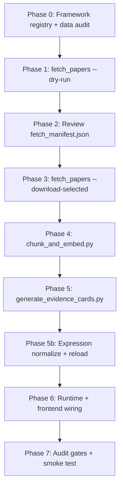

# Inducting a New Causal Pathway — Generic Playbook

**Date:** 2026-06-07 · **Updated:** 2026-06-15  
**Scope:** Repeatable workflow for adding any **production system → observed stress → causal pathway** branch  
**Prerequisites (complete):** [06-variable-naming-normalization.md](./06-variable-naming-normalization.md), [07-reasoning-prompt-signal-evaluation.md](./07-reasoning-prompt-signal-evaluation.md), [08-mws-multi-tehsil-membership.md](./08-mws-multi-tehsil-membership.md)  
**Related docs:** `PREPROCESS.md`, `02-preprocessing-checklist.md`, `04-artifact-relationships.md`, [09-excel-source-update.md](./09-excel-source-update.md)

---

## Purpose

This is the repeatable playbook for extending the diagnosis stack with new evidence-backed pathways:

1. Confirm Excel + registry coverage for diagnostic variables
2. Search for open-access papers → human review → chunk & embed
3. Generate evidence cards with **registry-valid expressions**
4. Wire framework resolvers, signal evaluation, follow-ups, visualization, and frontend
5. Run audit gates (variable registry, signal matrix, AER coverage)
6. Smoke-test end-to-end diagnosis

The **worked example** at the end covers the NTFP + Socio-Economic batch (five pathways; `land_degradation` removed).

---

## Current architecture (post-normalization)

| Layer | Source of truth | Notes |
|-------|-----------------|-------|
| Variable names | `metadata/data_dictionary_v2.json` + `runtime/services/variable_registry.py` | Canonical names; legacy aliases rewritten at eval time |
| Framework variables | `metadata/diagnosis_framework.json` | `availability: available \| not_available` |
| Mongo paths | `scripts/ingest_excel.py` normalizers | Drought nested keys canonicalized on ingest/backfill |
| Assembly | `runtime/services/assembler.py` → `VARIABLE_RESOLVERS` | Exposes canonical keys in `present_variables` |
| Signal eval | `runtime/services/signal_evaluator.py` | Backend pre-eval before LLM; same logic as matrix audit |
| Reasoner | `runtime/services/reasoner.py` | Injects `[SIGNAL EVALUATION RESULTS]`; LLM interprets, does not re-run Python |
| Follow-ups | `runtime/services/diagnosis_revision.py` + card `missing_variable_questions` | Qualitative answers wired via diagnostic signals |
| Retrieval | `runtime/services/retriever.py` | Pathway tags + AER tags + semantic embedding text |
| Tehsil context | `runtime/services/tehsil_refs.py` | Session tehsil + multi-tehsil `mws_data.tehsils[]` |

**Rule:** Every new `availability: available` framework variable must resolve through the registry → ingest → assembler chain before expecting good diagnosis or valid card expressions.

---

## Naming convention (use everywhere)

| Layer | Format | Example |
|--------|--------|---------|
| Framework JSON | `ProductionSystem.observed_stresses.stress.causal_pathways.pathway` | `NTFP_Forest_Biodiversity.ntfp_decline.forest_degradation` |
| Pipeline keys | `{production}__{stress}__{pathway}` (lowercase) | `ntfp_forest_biodiversity__ntfp_decline__forest_degradation` |
| Evidence card ID | pipeline key + `__{cluster_suffix}` | `…__forest_degradation__001` |

**Framework note:** In `diagnosis_framework.json`, `low_income` is a separate **observed stress** under `Socio_Economic`, not a pathway under `economic_hardship`. Use:

- `socio_economic__economic_hardship__multi_sector_vulnerability`
- `socio_economic__low_income__small_landholding` (not `economic_hardship → low_income`)

---

## End-to-end flow



---

## Phase 0 — Framework, registry & data readiness

**Goal:** The pathway exists in metadata; every `available` variable is ingestible and resolvable.

### 0.1 Add pathway to `metadata/diagnosis_framework.json`

- `description`, `diagnostic_variables` (with `availability`), `solutions`, optional `case_study_examples`
- Mark only genuinely absent Excel fields as `not_available` (e.g. `ntfp_species_presence`, `household_income_inr`)
- Use **canonical variable names** from `data_dictionary_v2.json` (see plan 06)

### 0.2 Add search queries to `metadata/pathway_queries.json`

- One entry per pipeline key, 8–12 India-specific queries
- **Removed (2026-06):** `ntfp_forest_biodiversity__ntfp_decline__land_degradation`

### 0.3 Reload framework to MongoDB

```powershell
.\.venv\Scripts\python.exe scripts\load_metadata_to_mongo.py
```

### 0.4 Excel / ingest readiness (if variables are new or tehsil data updated)

Follow [09-excel-source-update.md](./09-excel-source-update.md) when CoRE Stack Excel adds columns, sheets, or years.

Quick gate after ingest:

```powershell
.\.venv\Scripts\python.exe scripts\verify\verify_ingest.py
.\.venv\Scripts\python.exe scripts\verify\audit_excel_core_stack.py --from-active
```

### 0.5 Variable registry audit (mandatory before card work)

```powershell
.\.venv\Scripts\python.exe scripts\verify\audit_variable_registry.py
```

**Output:** `data/audits/variable_naming_<date>.json`

| Severity | Action |
|----------|--------|
| **BLOCKER** | Unknown identifier in card expression → fix registry, ingest, assembler, or expression |
| **SHAPE** | Wrong type usage (`[-1]` on static var) → rewrite expression |
| **NESTED** | Wrong drought sub-field → use registry `source_key_map` / nested schema |
| **ALIAS** | Legacy name mappable → run normalizer or update card |

### 0.6 Resolver spot-check for the new pathway

```powershell
.\.venv\Scripts\python.exe scripts\verify\spot_check_resolvers.py --uid <mws_uid>
```

Add missing resolvers in `runtime/services/assembler.py` (or extend `variable_registry.py` helpers). Village aggregates and facility distances are enriched in `runtime/services/mws_enrich.py` at read time.

### 0.7 Optional: auto-add framework variables from card expressions

If cards reference variables not yet listed in the framework:

```powershell
.\.venv\Scripts\python.exe scripts\patch_framework_expression_vars.py --dry-run
.\.venv\Scripts\python.exe scripts\patch_framework_expression_vars.py --apply
```

Review additions manually — do not blindly mark everything `available`.

---

## Phase 1 — Search for papers (metadata only)

**Script:** `scripts/fetch_papers.py`  
**Inputs:** `metadata/pathway_queries.json`, OpenAlex (+ optional Semantic Scholar)

```powershell
.\.venv\Scripts\python.exe scripts\fetch_papers.py `
  --pathway-prefix ntfp_forest_biodiversity__ntfp_decline --dry-run

.\.venv\Scripts\python.exe scripts\fetch_papers.py `
  --pathway-prefix socio_economic --dry-run

# Or one pathway at a time
.\.venv\Scripts\python.exe scripts\fetch_papers.py `
  --pathway ntfp_forest_biodiversity__ntfp_decline__forest_degradation --dry-run
```

**Defaults:** `--max-per-pathway 25` candidates per pathway.

**Outputs:**

- `data/papers/metadata/<paper_id>.json`
- `data/papers/fetch_manifest.json` (merges with existing corpus; **preserves** prior `include_in_corpus` flags)

**Expect noise:** Keyword search will surface tangentially related papers. Phase 2 is mandatory.

---

## Phase 2 — Human review (`include_in_corpus`)

Open `data/papers/fetch_manifest.json`. For each new paper, check `title`, `abstract`, `discovered_via_query`, `pathway_tags`. Set **`include_in_corpus`: `true`** only if the paper supports the causal mechanism.

```powershell
.\.venv\Scripts\python.exe scripts\verify\verify_papers.py
.\.venv\Scripts\python.exe scripts\validate_manifest.py   # must pass before download
```

**Preserve decisions:** Back up exclusions to `data/papers/include_in_corpus_exclusions.json`. Re-apply after fetch re-runs:

```powershell
.\.venv\Scripts\python.exe scripts\restore_manifest_exclusions.py
```

**Do not proceed to download until validation is clean.**

---

## Phase 3 — Download PDFs

```powershell
.\.venv\Scripts\python.exe scripts\fetch_papers.py --download-selected
.\.venv\Scripts\python.exe scripts\sync_manifest_pdfs.py
```

Only papers with `include_in_corpus: true` are downloaded. Typical OA success ~60%.

---

## Phase 4 — Chunk & embed papers

```powershell
.\.venv\Scripts\python.exe scripts\chunk_and_embed.py --dry-run
.\.venv\Scripts\python.exe scripts\chunk_and_embed.py --limit 1
.\.venv\Scripts\python.exe scripts\chunk_and_embed.py
.\.venv\Scripts\python.exe scripts\verify\verify_chunks.py
.\.venv\Scripts\python.exe scripts\verify\audit_chunk_coverage.py
```

Upserts into MongoDB `paper_chunks` (resumable; skips existing `paper_id`s).

---

## Phase 5 — Generate evidence cards

```powershell
.\.venv\Scripts\python.exe scripts\generate_evidence_cards.py `
  --pathway-prefix ntfp_forest_biodiversity__ntfp_decline --dry-run

.\.venv\Scripts\python.exe scripts\generate_evidence_cards.py `
  --pathway-prefix ntfp_forest_biodiversity__ntfp_decline --limit 1

.\.venv\Scripts\python.exe scripts\generate_evidence_cards.py `
  --pathway-prefix ntfp_forest_biodiversity__ntfp_decline

.\.venv\Scripts\python.exe scripts\generate_evidence_cards.py `
  --pathway-prefix socio_economic
```

**Semantic aliases:** Card embeddings use alias-augmented text from `metadata/semantic_aliases.json` (`scripts/lib/card_embedding_text.py`).

**Produces:** one card per **pathway × context cluster** (6 clusters in `CONTEXT_CLUSTERS`); raw JSON under `data/evidence_cards/raw/`; MongoDB `evidence_cards` with embeddings.

**Spot-check each card:**

- `causal_pathway` matches pipeline key
- `diagnostic_signals[].condition.expression` uses **registry-canonical** names
- `missing_variable_questions` only for `not_available` framework variables
- `aer_tags` / aquifer tags sensible for retrieval

### Phase 5b — Expression normalization & reload (mandatory)

Cards from Claude often need deterministic rewrites before production:

```powershell
# Preview rewrites
.\.venv\Scripts\python.exe scripts\maintenance\normalize_evidence_card_expressions.py --dry-run

# Apply to raw JSON
.\.venv\Scripts\python.exe scripts\maintenance\normalize_evidence_card_expressions.py --apply

# Reload Mongo + re-embed
.\.venv\Scripts\python.exe scripts\reload_evidence_cards.py

# Re-run registry audit
.\.venv\Scripts\python.exe scripts\verify\audit_variable_registry.py
```

**Prompt QA:**

```powershell
.\.venv\Scripts\python.exe scripts\maintenance\audit_evidence_card_prompts.py
```

**After alias / embedding text changes:**

```powershell
.\.venv\Scripts\python.exe scripts\maintenance\preview_card_embedding_text.py --prefix <pathway> --show-legacy
.\.venv\Scripts\python.exe scripts\reembed_evidence_cards.py --apply
```

---

## Phase 6 — Runtime & frontend wiring

### 6a. Variable assembly (`runtime/services/assembler.py`)

For each new pathway, ensure every `availability: available` variable has a resolver keyed by **canonical name**. Common families:

| Pathway family | Key variables |
|----------------|---------------|
| NTFP / forest | `lulc_tree_forest_ha`, `cd_total_deforestation_ha`, `cd_forest_to_farm_ha`, `cd_total_degradation_ha`, restoration ha fields, `organization_domains` |
| Socio-economic | `drought_weeks_severe`, NREGA counts, `cropping_intensity`, village aggregates, `dist_*_km` facility distances |
| Water / ag | SOGE, SWB, hydrological annual/seasonal, aquifer class |

Run `spot_check_resolvers.py` after changes.

### 6b. Follow-up signal wiring

Wire structured follow-up questions to evaluable diagnostic signals:

```powershell
# Review planned changes for the pathway prefix
.\.venv\Scripts\python.exe scripts\maintenance\wire_follow_up_signals.py --prefix <pathway> --dry-run

# Apply (updates raw cards + reload path documented in script)
.\.venv\Scripts\python.exe scripts\maintenance\wire_follow_up_signals.py --prefix <pathway> --apply
```

Use as a **template** when adding new `missing_variable_questions` — adapt variable renames for your pathway rather than re-running the NTFP/socio batch blindly.

### 6c. Visualization spec (`metadata/reference_standards.json`)

Add **`query_triggered_panel_updates`** entries so diagnosis highlights relevant charts. Add **`single_variable`** / **`variable_pairs`** chart specs if new chart types are needed.

### 6d. Frontend (`frontend/`)

| File | Change |
|------|--------|
| `src/utils/panelUpdates.ts` | Human-readable labels for new `panel_updates` keys |
| `src/components/charts/MwsCharts.tsx` | Charts for new variables |
| `src/components/InfoPanel.tsx` | Wire charts into default or query-triggered sections |

Map UX (frozen diagnosis panel, cross-tehsil browse/restore) is in `frontend/src/App.tsx` — no per-pathway changes usually needed.

### 6e. Reasoner / signal evaluation (plan 07 — already in runtime)

- Backend evaluates bundle signals before LLM call (`evaluate_bundle_signals`)
- Follow-ups inject user answers into eval context (`diagnosis_revision.py`)
- Do **not** ask the LLM to re-run Python for signals with `status: ok`

After adding resolvers, re-test that follow-ups target genuinely missing fields only.

### 6f. AER retrieval coverage

After tagging cards with `aer_tags`:

```powershell
.\.venv\Scripts\python.exe scripts\maintenance\audit_aer_card_coverage.py
```

Set AER tags at generation time; use `scripts/maintenance/fetch_aer_geojson.py` + `backfill_mws_aer.py` when refreshing NBSS-LUP boundaries.

---

## Phase 7 — Verification checklist

### Corpus & cards

```powershell
.\.venv\Scripts\python.exe scripts\validate_manifest.py
.\.venv\Scripts\python.exe scripts\verify\verify_chunks.py
.\.venv\Scripts\python.exe scripts\verify\verify_evidence_cards.py
```

### Variable & signal gates (mandatory)

```powershell
.\.venv\Scripts\python.exe scripts\verify\audit_variable_registry.py
.\.venv\Scripts\python.exe scripts\verify\evaluate_signal_matrix.py
.\.venv\Scripts\python.exe scripts\verify\spot_check_resolvers.py --uid <mws_uid>
```

**Signal matrix baseline:** 32 case-study MWS × all cards — **0 hard runtime errors** (see plan 07).

### Unit tests

```powershell
.\.venv\Scripts\python.exe scripts\test\test_variable_registry.py
.\.venv\Scripts\python.exe scripts\test\test_derived_variables.py
.\.venv\Scripts\python.exe scripts\test\test_signal_evaluator.py
.\.venv\Scripts\python.exe scripts\test\test_signal_evaluator_matrix.py
.\.venv\Scripts\python.exe scripts\test\test_expression_audit.py
.\.venv\Scripts\python.exe scripts\test\test_follow_up_signals.py
.\.venv\Scripts\python.exe scripts\test\test_diagnosis_revision.py
.\.venv\Scripts\python.exe scripts\test\test_prompt_builder.py
.\.venv\Scripts\python.exe scripts\test\test_retrieval_and_followup.py
.\.venv\Scripts\python.exe scripts\test\test_retriever_aer.py
.\.venv\Scripts\python.exe scripts\test\test_panel_updates.py
.\.venv\Scripts\python.exe scripts\test\test_parse_json_response.py
```

### UI smoke test

```powershell
cd runtime
..\.venv\Scripts\python.exe -m uvicorn main:app --host 127.0.0.1 --port 8000
# separate terminal:
..\.venv\Scripts\python.exe scripts\test\smoke_test_diagnosis.py
```

In the UI:

1. Select an MWS with relevant data
2. Run a problem description that should retrieve the new pathway
3. Confirm: correct pathways ranked, charts activate via `panel_updates`, follow-ups only for genuinely missing fields
4. Browse another tehsil/MWS during a run — left panel stays frozen; map restores after query/follow-up

---

## Worked example: five pathways (NTFP + Socio-Economic)

| # | Framework path | Pipeline key |
|---|----------------|--------------|
| 1 | NTFP → ntfp_decline → forest_degradation | `ntfp_forest_biodiversity__ntfp_decline__forest_degradation` |
| 2 | NTFP → ntfp_decline → encroachment | `ntfp_forest_biodiversity__ntfp_decline__encroachment` |
| 3 | ~~NTFP → ntfp_decline → land_degradation~~ | **Removed** |
| 4 | Socio → economic_hardship → multi_sector_vulnerability | `socio_economic__economic_hardship__multi_sector_vulnerability` |
| 5 | Socio → low_income → small_landholding | `socio_economic__low_income__small_landholding` |

**Suggested command sequence:**

```powershell
# 0. Framework + registry audit
.\.venv\Scripts\python.exe scripts\load_metadata_to_mongo.py
.\.venv\Scripts\python.exe scripts\verify\audit_variable_registry.py

# 1–2. Fetch + review
.\.venv\Scripts\python.exe scripts\fetch_papers.py --pathway-prefix ntfp_forest_biodiversity__ntfp_decline --dry-run
.\.venv\Scripts\python.exe scripts\fetch_papers.py --pathway-prefix socio_economic --dry-run
.\.venv\Scripts\python.exe scripts\validate_manifest.py

# 3–5. Download → chunk → cards → normalize
.\.venv\Scripts\python.exe scripts\fetch_papers.py --download-selected
.\.venv\Scripts\python.exe scripts\chunk_and_embed.py
.\.venv\Scripts\python.exe scripts\generate_evidence_cards.py --pathway-prefix ntfp_forest_biodiversity__ntfp_decline
.\.venv\Scripts\python.exe scripts\generate_evidence_cards.py --pathway-prefix socio_economic
.\.venv\Scripts\python.exe scripts\maintenance\normalize_evidence_card_expressions.py --apply
.\.venv\Scripts\python.exe scripts\reload_evidence_cards.py
.\.venv\Scripts\python.exe scripts\maintenance\wire_follow_up_signals.py --prefix socio_economic --apply

# 6–7. Gates + smoke
.\.venv\Scripts\python.exe scripts\verify\audit_variable_registry.py
.\.venv\Scripts\python.exe scripts\verify\evaluate_signal_matrix.py
.\.venv\Scripts\python.exe scripts\maintenance\audit_aer_card_coverage.py
.\.venv\Scripts\python.exe scripts\test\smoke_test_diagnosis.py
```

---

## What stays unchanged vs what you touch each time

| Artifact | Every new pathway? |
|----------|-------------------|
| `diagnosis_framework.json` | Yes — pathway + variables |
| `pathway_queries.json` | Yes — queries per pathway |
| `data_dictionary_v2.json` | Only if new Excel fields |
| `variable_registry.py` / resolvers | Yes — if new `available` variables |
| `fetch_manifest.json` | Grows; you review |
| `paper_chunks`, `evidence_cards` | Grows via scripts |
| `reference_standards.json` | Yes — panel triggers & chart specs |
| Frontend charts / InfoPanel | Yes — if new variables need visualization |
| `wire_follow_up_signals.py` | Template — adapt for new follow-ups |
| `PREPROCESS.md` | Update when a production system is fully onboarded |

---

## Script inventory (maintained)

### Keep — verification gates

| Script | Role |
|--------|------|
| `verify/audit_variable_registry.py` | Registry ↔ framework ↔ assembler ↔ cards |
| `verify/evaluate_signal_matrix.py` | Full signal eval matrix (0 hard errors) |
| `verify/audit_excel_core_stack.py` | Excel vs CoRE Stack API |
| `verify/spot_check_resolvers.py` | Per-MWS resolver spot check |
| `verify/verify_ingest.py` | Post-ingest sanity |
| `verify/verify_papers.py` | Manifest / PDF status |
| `verify/verify_chunks.py` | Chunk collection summary |
| `verify/audit_chunk_coverage.py` | Corpus chunk completeness |
| `verify/verify_evidence_cards.py` | Card counts / embeddings |

### Keep — maintenance

| Script | Role |
|--------|------|
| `maintenance/normalize_evidence_card_expressions.py` | Deterministic expression rewrites |
| `maintenance/audit_evidence_card_prompts.py` | Prompt / JSON staleness audit |
| `maintenance/audit_aer_card_coverage.py` | AER tag coverage |
| `maintenance/wire_follow_up_signals.py` | Follow-up → signal wiring template |
| `maintenance/preview_card_embedding_text.py` | Pre-flight embed preview |
| `maintenance/backfill_mws_variable_names.py` | Drought key backfill (idempotent) |
| `maintenance/backfill_mws_tehsils.py` | Multi-tehsil membership backfill |
| `maintenance/backfill_mws_aer.py` | AER code point-in-polygon |
| `maintenance/fetch_aer_geojson.py` | Refresh NBSS-LUP GeoJSON |
| `maintenance/purge_pathway_from_mongo.py` | Retire a pathway |
| `maintenance/purge_excluded_chunks.py` | Drop excluded paper chunks |

### Removed (obsolete one-offs)

| Script | Reason |
|--------|--------|
| `maintenance/patch_deccan_aer_tags.py` | Applied AER-3 patch for two card suffixes; superseded by generation-time tagging + `audit_aer_card_coverage.py` |
| `test/test_bundle_signal_eval.py` | Single-sample duplicate of `test_follow_up_signals.py` / `test_signal_evaluator.py` |

---

## Default script scopes (watch out)

`fetch_papers.py` and `generate_evidence_cards.py` default to `--pathway-prefix agriculture__water_scarcity`. Always pass an explicit `--pathway-prefix` or `--pathway` when inducting NTFP, socio, or other systems.

---

## Practical scope estimate (NTFP + Socio batch)

| Step | NTFP (2 pathways) + Socio (2) |
|------|-------------------------------|
| Paper metadata fetch | ~100 candidate records (25 × 4) |
| After review | ~30–50 included papers (typical) |
| Evidence cards | 4 pathways × 6 clusters = **24 cards** |
| Claude API cost | Similar order to water-scarcity batch (~$3–8 depending on chunk volume) |
