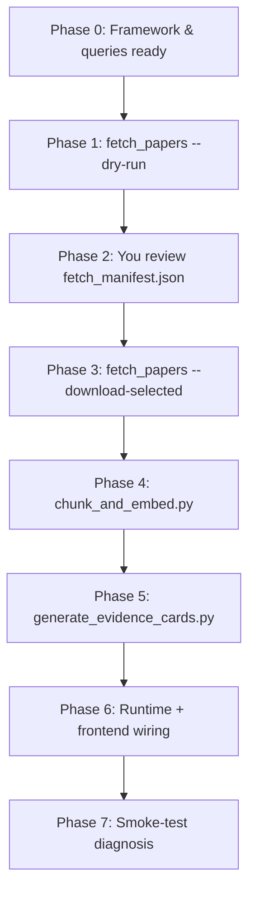

# Inducting a New Causal Pathway — Generic Playbook

**Date:** 2026-06-07  
**Scope:** Repeatable workflow for adding any **production system → observed stress → causal pathway** branch  
**Related docs:** `PREPROCESS.md`, `02-preprocessing-checklist.md`, `04-artifact-relationships.md`

---

## Purpose

This is the repeatable playbook for extending the diagnosis stack with new evidence-backed pathways:

1. Search for open-access papers
2. Human review (`include_in_corpus`)
3. Download PDFs → chunk & embed → evidence cards
4. Wire runtime resolvers, visualization specs, and frontend charts
5. Smoke-test end-to-end diagnosis

The **worked example** at the end covers five pathways requested for the next corpus batch (NTFP + Socio-Economic).

---

## Naming convention (use everywhere)

| Layer | Format | Example |
|--------|--------|---------|
| Framework JSON | `ProductionSystem.observed_stresses.stress.causal_pathways.pathway` | `NTFP_Forest_Biodiversity.ntfp_decline.forest_degradation` |
| Pipeline keys | `{production}__{stress}__{pathway}` (lowercase) | `ntfp_forest_biodiversity__ntfp_decline__forest_degradation` |
| Evidence card ID | pipeline key + `__{cluster_suffix}` | `…__forest_degradation__001` |

**Framework note:** In `diagnosis_framework.json`, `low_income` is a separate **observed stress** under `Socio_Economic`, not a pathway under `economic_hardship`. Its pathway is `small_landholding`. Use:

- `socio_economic__economic_hardship__multi_sector_vulnerability`
- `socio_economic__low_income__small_landholding` (not `economic_hardship → low_income`)

---

## End-to-end flow



---

## Phase 0 — Framework & metadata readiness

**Goal:** The pathway exists in metadata before any corpus work.

### 0.1 Confirm pathway in `metadata/diagnosis_framework.json`

- `description`, `diagnostic_variables` (with `availability: available | not_available`), `solutions`, optional `case_study_examples`
- Mark only genuinely absent Excel fields as `not_available` (e.g. `ntfp_species_presence`, `household_income_inr`)

### 0.2 Add or refine search queries in `metadata/pathway_queries.json`

- One entry per pipeline key, 8–12 India-specific queries
- NTFP + socio queries for the other four example pathways already exist
- **Removed (2026-06):** `ntfp_forest_biodiversity__ntfp_decline__land_degradation` — pathway dropped from framework and corpus

### 0.3 Reload framework to MongoDB (if you edit framework)

```powershell
.\.venv\Scripts\python.exe scripts\load_metadata_to_mongo.py
```

### 0.4 Data / resolver audit

Do this per pathway before expecting good diagnosis:

- For every variable marked `availability: available`, confirm it resolves from ingested Excel → `mws_data` / `village_data`
- Several socio/NTFP variables are marked available in the framework but still unresolved in `runtime/services/assembler.py` (e.g. `village_sc_percent`, `dist_bank_km`, `dist_apmc_km`). Plan resolver work in Phase 6

---

## Phase 1 — Search for papers (metadata only)

**Script:** `scripts/fetch_papers.py`  
**Inputs:** `metadata/pathway_queries.json`, OpenAlex (+ optional Semantic Scholar)

```powershell
# All pathways matching a prefix (review scope)
.\.venv\Scripts\python.exe scripts\fetch_papers.py `
  --pathway-prefix ntfp_forest_biodiversity__ntfp_decline --dry-run

.\.venv\Scripts\python.exe scripts\fetch_papers.py `
  --pathway-prefix socio_economic__economic_hardship --dry-run

.\.venv\Scripts\python.exe scripts\fetch_papers.py `
  --pathway-prefix socio_economic__low_income --dry-run

# Or one pathway at a time
.\.venv\Scripts\python.exe scripts\fetch_papers.py `
  --pathway ntfp_forest_biodiversity__ntfp_decline__forest_degradation --dry-run
```

**Defaults:** `--max-per-pathway 25` candidates per pathway.

**Outputs:**

- `data/papers/metadata/<paper_id>.json`
- `data/papers/fetch_manifest.json` (review ledger; merges with existing corpus, preserves prior `include_in_corpus` flags)

**Expect noise:** Keyword search will surface tangentially related papers. Phase 2 is mandatory.

---

## Phase 2 — Human review (`include_in_corpus`)

**Your step:** Open `data/papers/fetch_manifest.json`.

For each new paper, check:

- `title`, `abstract`, `discovered_via_query`, `pathway_tags`
- Set **`include_in_corpus`: `true`** only if the paper supports the causal mechanism (not just shared keywords)

Helpers:

```powershell
.\.venv\Scripts\python.exe scripts\verify\verify_papers.py
.\.venv\Scripts\python.exe scripts\validate_manifest.py   # must pass before download
```

**Preserve decisions:** Back up exclusions to `data/papers/include_in_corpus_exclusions.json` so re-runs of `fetch_papers.py` do not lose your review. Use `scripts/restore_manifest_exclusions.py` if needed.

**Do not proceed to download until validation is clean.**

---

## Phase 3 — Download PDFs

```powershell
.\.venv\Scripts\python.exe scripts\fetch_papers.py --download-selected
.\.venv\Scripts\python.exe scripts\sync_manifest_pdfs.py   # optional: see which PDFs landed
```

- Only papers with `include_in_corpus: true` are downloaded
- Typical OA success ~60%; set `include_in_corpus: false` on papers with no PDF, or add PDFs manually to `data/papers/pdfs/{paper_id}.pdf`

---

## Phase 4 — Chunk & embed papers

**Script:** `scripts/chunk_and_embed.py`  
**Requires:** Ollama (`nomic-embed-text`), MongoDB

```powershell
.\.venv\Scripts\python.exe scripts\chunk_and_embed.py --dry-run
.\.venv\Scripts\python.exe scripts\chunk_and_embed.py --limit 1
.\.venv\Scripts\python.exe scripts\chunk_and_embed.py
.\.venv\Scripts\python.exe scripts\verify\verify_chunks.py
```

- Processes papers with **`include_in_corpus: true` AND PDF on disk**
- Upserts into MongoDB `paper_chunks` (resumable; skips existing `paper_id`s)
- Re-run is safe after adding new pathways; only new included papers are processed

---

## Phase 5 — Generate evidence cards

**Script:** `scripts/generate_evidence_cards.py`  
**Requires:** `ANTHROPIC_API_KEY`, chunked papers, Ollama for card embeddings

```powershell
# Preview prompts for new pathways only
.\.venv\Scripts\python.exe scripts\generate_evidence_cards.py `
  --pathway-prefix ntfp_forest_biodiversity__ntfp_decline --dry-run

.\.venv\Scripts\python.exe scripts\generate_evidence_cards.py `
  --pathway-prefix socio_economic --dry-run

# Smoke test, then full run
.\.venv\Scripts\python.exe scripts\generate_evidence_cards.py `
  --pathway-prefix ntfp_forest_biodiversity__ntfp_decline --limit 1

.\.venv\Scripts\python.exe scripts\generate_evidence_cards.py `
  --pathway-prefix ntfp_forest_biodiversity__ntfp_decline

.\.venv\Scripts\python.exe scripts\generate_evidence_cards.py `
  --pathway-prefix socio_economic

.\.venv\Scripts\python.exe scripts\verify\verify_evidence_cards.py
```

**Semantic aliases:** Card embeddings use alias-augmented text from `metadata/semantic_aliases.json` (see `runtime/services/card_embedding_text.py`). After editing aliases:

```powershell
.\.venv\Scripts\python.exe scripts\maintenance\preview_card_embedding_text.py --prefix <pathway> --show-legacy
.\.venv\Scripts\python.exe scripts\reembed_evidence_cards.py --apply
```

**What it produces:**

- One card per **pathway × context cluster** (6 clusters in `CONTEXT_CLUSTERS` inside the script)
- Raw artifacts: `data/evidence_cards/raw/<card_id>.json`
- MongoDB `evidence_cards` with embeddings for retrieval

**After generation, spot-check each card:**

- `causal_pathway` matches pipeline key
- `diagnostic_signals` reference framework variable names
- `missing_variable_questions` only for `not_available` variables
- `pathway_tags` / aquifer / AER tags sensible for retrieval filters

**Optional:** Extend `CONTEXT_CLUSTERS` if new pathways need tribal-forest or tribal-livelihood geographic contexts not covered by existing clusters.

---

## Phase 6 — Runtime & frontend wiring

### 6a. Variable assembly (`runtime/services/assembler.py`)

For each new pathway, ensure every framework variable with `availability: available` has a resolver:

| Pathway family | Key variables to wire |
|----------------|------------------------|
| NTFP / forest | `lulc_tree_forest_ha`, `cd_total_deforestation_ha`, `cd_forest_to_farm_ha`, `cd_total_degradation_ha`, `restoration_protection_ha`, `restoration_widescale_ha`, `lulc_shrub_scrub_ha`, `organization_domains` |
| Socio-economic | `drought_weeks_severe`, `nrega_swc_count`, `cropping_intensity`, `lulc_cropland_ha`, village aggregates (`village_sc_percent`, `village_st_percent`, `village_literacy_rate`, `village_total_population`), distance fields (`dist_bank_km`, `dist_apmc_km`, `dist_dairy_km`) |

If village/distance data live in `village_data` rather than `mws_data`, add aggregation in ingest or a small enrich step.

### 6b. Visualization spec (`metadata/reference_standards.json`)

Add **`query_triggered_panel_updates`** entries so diagnosis can highlight relevant charts:

```json
"forest_degradation": [
  "lulc_tree_forest_ha trend",
  "cd_total_deforestation_ha + cd_total_afforestation_ha paired_bar"
],
"encroachment": [
  "lulc_tree_forest_ha trend",
  "cd_total_deforestation_ha + cd_total_afforestation_ha paired_bar"
],
"land_degradation": [
  "lulc_stacked_area",
  "cd_total_degradation_ha sparkline",
  "nrega_land_restoration_count bar"
],
"multi_sector_vulnerability": [
  "drought_weeks stacked_bar",
  "nrega_*_count stacked_bar_cumulative"
],
"small_landholding": [
  "cropping_intensity trend",
  "dist_*_km horizontal_bars"
]
```

Add any missing **`single_variable`** / **`variable_pairs`** entries if new chart types are needed.

### 6c. Frontend (`frontend/`)

| File | Change |
|------|--------|
| `src/utils/panelUpdates.ts` | Human-readable labels for new `panel_updates` keys |
| `src/components/charts/MwsCharts.tsx` | Charts if new variables need dedicated widgets (forest trend, NREGA stacked bar, distance bars) |
| `src/components/InfoPanel.tsx` | Wire new charts into default or query-triggered sections |

No map changes are usually needed unless new MWS boundary layers are involved.

### 6d. Reasoner / follow-up guardrails

Follow-ups should only target variables in `missing_variables` with authorized evidence-card questions. After adding resolvers, re-test that the model no longer asks for Excel-backed fields (single kharif, SWB, forest area, etc.).

---

## Phase 7 — Verification checklist

Run for each newly inducted pathway:

```powershell
# Corpus
.\.venv\Scripts\python.exe scripts\validate_manifest.py
.\.venv\Scripts\python.exe scripts\verify\verify_chunks.py
.\.venv\Scripts\python.exe scripts\verify\verify_evidence_cards.py

# Resolver spot-check
.\.venv\Scripts\python.exe scripts\verify\spot_check_resolvers.py --uid <mws_uid>

# Unit tests
.\.venv\Scripts\python.exe scripts\test\test_derived_variables.py
.\.venv\Scripts\python.exe scripts\test\test_retrieval_and_followup.py
```

In the UI:

1. Select an MWS with relevant data (forest cover for NTFP; village socio data for socio-economic)
2. Run a problem description that should retrieve the new pathway
3. Confirm: correct pathways ranked, charts activate via `panel_updates`, follow-ups only for genuinely missing fields

**Runtime smoke test:**

```powershell
cd runtime
..\.venv\Scripts\python.exe -m uvicorn main:app --host 127.0.0.1 --port 8000
```

---

## Worked example: five pathways (NTFP + Socio-Economic)

| # | Framework path | Pipeline key | Queries in `pathway_queries.json`? |
|---|----------------|--------------|-------------------------------------|
| 1 | NTFP → ntfp_decline → forest_degradation | `ntfp_forest_biodiversity__ntfp_decline__forest_degradation` | Yes |
| 2 | NTFP → ntfp_decline → encroachment | `ntfp_forest_biodiversity__ntfp_decline__encroachment` | Yes |
| 3 | ~~NTFP → ntfp_decline → land_degradation~~ | ~~`ntfp_forest_biodiversity__ntfp_decline__land_degradation`~~ | **Removed from framework** |
| 4 | Socio → economic_hardship → multi_sector_vulnerability | `socio_economic__economic_hardship__multi_sector_vulnerability` | Yes |
| 5 | Socio → low_income → small_landholding | `socio_economic__low_income__small_landholding` | Yes |

**Suggested command sequence for this batch:**

```powershell
# 0. Add land_degradation queries to pathway_queries.json, then:
.\.venv\Scripts\python.exe scripts\load_metadata_to_mongo.py

# 1–2. Fetch + your review
.\.venv\Scripts\python.exe scripts\fetch_papers.py --pathway-prefix ntfp_forest_biodiversity__ntfp_decline --dry-run
.\.venv\Scripts\python.exe scripts\fetch_papers.py --pathway-prefix socio_economic --dry-run
# … edit fetch_manifest.json …
.\.venv\Scripts\python.exe scripts\validate_manifest.py

# 3–5. Download → chunk → cards
.\.venv\Scripts\python.exe scripts\fetch_papers.py --download-selected
.\.venv\Scripts\python.exe scripts\chunk_and_embed.py
.\.venv\Scripts\python.exe scripts\generate_evidence_cards.py --pathway-prefix ntfp_forest_biodiversity__ntfp_decline
.\.venv\Scripts\python.exe scripts\generate_evidence_cards.py --pathway-prefix socio_economic

# 6–7. Wire assembler + reference_standards + frontend charts, then smoke-test
```

---

## What stays unchanged vs what you touch each time

| Artifact | Every new pathway? |
|----------|-------------------|
| `diagnosis_framework.json` | Only if pathway is new or variables change |
| `pathway_queries.json` | Yes — queries per pathway |
| `fetch_manifest.json` | Grows; you review |
| `paper_chunks`, `evidence_cards` | Grows via scripts |
| `assembler.py` | Yes — if new `available` variables |
| `reference_standards.json` | Yes — panel triggers & chart specs |
| Frontend charts / InfoPanel | Yes — if new variables need visualization |
| `PREPROCESS.md` | Update quick-reference when a production system is fully onboarded |

---

## Practical scope estimate (NTFP + Socio batch)

| Step | NTFP (3 pathways) + Socio (2) |
|------|-------------------------------|
| Paper metadata fetch | ~125 candidate records (25 × 5) |
| After review | ~30–50 included papers (typical) |
| Evidence cards | 5 pathways × 6 clusters = **30 cards** |
| Claude API cost | Roughly similar order to existing water-scarcity batch (~$3–8 depending on chunk volume) |

---

## Default script scopes (watch out)

`fetch_papers.py` and `generate_evidence_cards.py` default to `--pathway-prefix agriculture__water_scarcity`. Always pass an explicit `--pathway-prefix` or `--pathway` when inducting NTFP or socio pathways.
