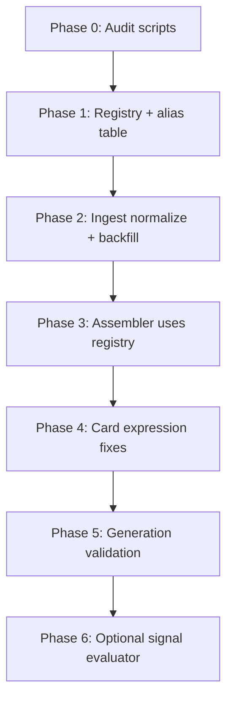

# Variable naming normalization — implementation plan

> **Status:** Complete (2026-06-15). Baseline audits in `data/audits/`.

The problem spans **four layers** that currently disagree:

| Layer | Example (drought SPI) | Example (change detection) |
|-------|----------------------|----------------------------|
| **Data dictionary** | `drought_causality` → nested `spi_score` | `cd_urbanization_ha` (static scalar) |
| **Mongo (`mws_data`)** | `drought_causality["2017"]["mild"]["mild_drought_spi_score"]` | `change_detection.urbanization.total_ha` |
| **Assembler / framework** | `drought_causality_json` (alias to mongo path) | `cd_total_urbanization_ha` (static scalar) |
| **Evidence card expressions** | `drought_causality_json.get('spi_class')`, `spi_kharif` | `cd_total_urbanization_ha[-1]` (treats static as time series) |

Expressions are meant to be evaluable Python against `present_variables`, but many reference **names and shapes that do not exist** in Mongo or the assembler output. Normalization must fix the chain end-to-end, not just the cards.

---

## Guiding principle

Introduce a **single canonical variable registry** (extending `metadata/data_dictionary_v2.json` or a sibling `metadata/variable_registry.json`) that is the source of truth for:

- **Canonical name** — what framework, assembler, LLM prompts, and expressions use
- **Mongo path** — where ingested data lives (`drought_causality`, `change_detection.urbanization.total_ha`, …)
- **Type** — `static`, `time_series`, `derived`, or `nested_time_series`
- **Nested schema** — sub-field names for complex variables (e.g. `severe_moderate.spi_score`)
- **Legacy aliases** — `drought_causality_json`, `spi_kharif`, `mild_drought_spi_score`, …
- **Framework aliases** — `annual_precipitation_mm` → `precipitation_mm`, etc.

All audit, ingest, assembler, card-fix, and generation code reads from this registry — not ad hoc string matching.

---

## Phase 0 — Audit scripts (read-only, run first)

**Goal:** Produce a report of every mismatch before changing anything.

### 0a. `scripts/verify/audit_variable_registry.py`

Cross-check registry ↔ existing artifacts:

| Check | What it validates |
|-------|-------------------|
| Dictionary completeness | Every `diagnostic_variables[].variable` in `diagnosis_framework.json` has a registry entry |
| Resolver coverage | Every framework variable has an assembler resolver (or is explicitly `not_available`) |
| Resolver ↔ Mongo | For a sample of MWS docs (+ all 32 case-study MWS), resolver output shape matches registry `type` |
| Unknown identifiers in cards | Parse all signal `expression` strings; flag names not in registry |
| Shape misuse | e.g. `[-1]` on static vars, `.get('spi_class')` on year-keyed dicts |
| Nested field drift | Collect all keys seen under `drought_causality.*` in Mongo vs registry nested schema |

Output: JSON + human-readable report (`data/audits/variable_naming_<date>.json`) grouped by severity:

- **BLOCKER** — expression references unknown variable
- **SHAPE** — correct name but wrong type usage (`cd_total_urbanization_ha[-1]`)
- **NESTED** — wrong sub-field (`spi_class` vs `spi_score`)
- **ALIAS** — legacy name still in use but mappable

Reuse expression parsing from card JSON (regex/AST for identifiers); optionally dry-run evaluation against `data/raw_jsons/*.json` case-study exports.

### 0b. Extend `scripts/verify/verify_ingest.py`

Add ingest-specific checks driven by registry:

- Expected top-level Mongo keys exist per MWS
- Nested drought causality fields normalized (or flag raw Excel keys like `mild_drought_spi_score`)
- Change-detection fields match dictionary names (`total_ha` vs `cd_total_*`)

---

## Phase 1 — Canonical registry design

**Goal:** Resolve naming policy decisions in metadata before code changes.

### 1a. Extend `data_dictionary_v2.json` (preferred) with per-variable fields

```json
"drought_causality": {
  "type": "nested_time_series",
  "framework_name": "drought_causality",
  "mongo_field": "drought_causality",
  "nested_schema": {
    "severe_moderate": ["spi_score", "mai_score", "vci_score", "cropping_area_sown_score"],
    "mild": ["spi_score", "mai_score", "vci_score", "cropping_area_sown_score"]
  },
  "source_key_map": {
    "mild_drought_spi_score": "spi_score",
    "moderate_drought_mai_score": "mai_score"
  },
  "legacy_aliases": ["drought_causality_json"]
}
```

### 1b. Document top-level alias table

| Canonical (dictionary) | Framework / assembler today | Action |
|------------------------|----------------------------|--------|
| `precipitation_mm` | `annual_precipitation_mm` | Keep assembler alias OR rename framework to canonical |
| `drought_causality` | `drought_causality_json` | Drop `_json` suffix; treat as alias during migration |
| `cd_urbanization_ha` | `cd_total_urbanization_ha` | Pick one; map in registry |
| `cd_deforestation_ha.total_deforestation` | `cd_total_deforestation_ha` | Flatten in registry with mongo path |

**Recommendation:** Canonical names = **data dictionary names** for top-level variables; assembler exposes those names directly (with deprecated aliases logged during transition).

### 1c. Expression access pattern for nested time series

Define a standard eval pattern, e.g. helper functions injected at evaluation time:

```python
# Latest-year severe/moderate SPI score
drought_spi_score(severity="severe_moderate")  # or
drought_causality[-1]["severe_moderate"]["spi_score"]
```

Pick one pattern, document it in `generate_evidence_cards.py` expression rules, and enforce in audit.

---

## Phase 2 — Ingest normalization

**Goal:** Mongo stores dictionary-shaped data, not raw Excel keys.

### 2a. `scripts/ingest_excel.py` — `normalize_drought_causality()`

After `parse_drought_causality()`, remap source keys → canonical nested schema:

- `mild_drought_spi_score` → `spi_score`
- `moderate_drought_path3` → document or map to canonical field
- Preserve raw keys optionally under `_raw` for debugging

### 2b. Change-detection normalization

Ensure ingested `change_detection` sub-documents align with dictionary (`cd_degradation_ha`, `cd_deforestation_ha`, …) and expose flat scalars where the framework expects them.

### 2c. Backfill script

`scripts/maintenance/backfill_mws_variable_names.py`:

- Read existing `mws_data` docs
- Apply same normalizers as ingest
- Idempotent upsert; report counts of transformed fields

### 2d. Re-run ingest audit

Verify case-study MWS (`data/raw_jsons/`) show canonical nested keys after backfill.

---

## Phase 3 — Assembler alignment

**Goal:** `present_variables` keys and values match registry exactly.

### 3a. Centralize in `runtime/services/variable_registry.py`

- `load_registry()`, `canonical_name()`, `resolve(mws_doc, name)`, `eval_context(present_variables)`
- Move resolver map from `assembler.py` here; resolvers return **canonical names**

### 3b. Update `assembler.py`

- `VARIABLE_RESOLVERS` keys → canonical names from registry
- Deprecation warnings for old names (`drought_causality_json` → `drought_causality`)
- For nested time series: optionally expose **derived convenience scalars** at assembly time (e.g. `drought_spi_score_latest`) if expressions need simple comparisons

### 3c. Update `derived_variables.py`, `reasoner.py`, `generate_evidence_cards.py`

- Import registry instead of duplicated name lists
- Generation prompts reference registry names + nested access examples (not invented `spi_class`)

### 3d. Update `scripts/export_case_study_mws_variables.py`

- Export canonical names only (already close; align with registry)

---

## Phase 4 — Evidence card correction

**Goal:** All 136 cards use registry-valid expressions.

### 4a. `scripts/maintenance/audit_evidence_card_expressions.py`

(Or extend Phase 0 audit) — per card:

- List signals with invalid identifiers
- Suggest automated rewrites from alias table
- Flag unfixable expressions for manual review

### 4b. `scripts/maintenance/normalize_evidence_card_expressions.py`

- Apply deterministic rewrites: alias substitution, static-vs-series fixes
- For drought: rewrite `drought_causality_json.get('spi_class')` → canonical nested access
- Update `diagnostic_signals[].condition.variables` arrays to match
- Validate against JSON schema + registry
- Write patched JSON to `data/evidence_cards/raw/` and upsert Mongo via existing reload path

### 4c. Manual review queue

Some expressions need semantic rewrite (not just rename), e.g.:

- `spi_class in ['moderate_drought', …]` → threshold on `spi_score` or a derived drought class variable
- Decide whether to add a **derived** `drought_spi_class_latest` computed at assembly time from `spi_score` thresholds (India Drought Manual)

---

## Phase 5 — Generation pipeline hardening

**Goal:** Prevent recurrence in future card generation.

- Update `expression_rules_block()` in `generate_evidence_cards.py`:
  - Inject registry excerpt for pathway variables (names + types + nested schema)
  - Explicit drought causality example using real Mongo shape
  - Ban `.get('spi_class')`-style invented fields
- Add post-generation validation step in `generate_evidence_cards.py`:
  - Run expression audit before Mongo upsert; reject cards with unknown identifiers
- Add `scripts/test/test_variable_registry.py` + `test_expression_audit.py`

---

## Phase 6 — Runtime expression evaluation (if/when automated)

Today the reasoner asks the LLM to evaluate expressions mentally. For reliable diagnosis:

- Add `runtime/services/signal_evaluator.py` using registry `eval_context()`
- Inject same variable names/shapes as assembler into a restricted eval namespace
- Unit-test against case-study MWS exports: every card signal should eval without `NameError`/`AttributeError`

---

## Implementation order (recommended)



| Step | Deliverable | Risk |
|------|-------------|------|
| 0 | Audit report listing all mismatches | None (read-only) |
| 1 | Registry metadata + policy doc | Low |
| 2 | Mongo backfill | Medium — test on subset first |
| 3 | Assembler refactor | Medium — update tests |
| 4 | Card patches | High — some need semantic rewrite |
| 5 | Generation guardrails | Low |
| 6 | Runtime evaluator | Optional enhancement |

---

## Known issue categories (from current corpus)

1. **Invented nested keys** — `spi_kharif`, `spi_class`, `mai_class`, `vci_kharif` on `drought_causality_json`
2. **Raw Excel keys in Mongo** — `mild_drought_spi_score` vs dictionary `spi_score`
3. **Top-level aliases** — `drought_causality_json`, `annual_*_mm`, `cd_total_*_ha`
4. **Static vs time series** — `cd_*` indexed with `[-1]`; change detection is cumulative static, not yearly
5. **Framework ↔ dictionary gaps** — `landholding_size_distribution` vs `landholding_distribution`

---

## Success criteria

- Audit script exits 0 on full corpus (136 cards × case-study MWS)
- Case-study JSON exports use only canonical names and shapes
- Assembler `present_variables` keys match dictionary registry
- Every signal expression references only registry-known identifiers with correct type usage
- New card generation fails fast if expressions reference unknown names

---

## Suggested first PR (smallest useful slice)

1. Phase 0 audit script + run against current 136 cards and 32 case-study MWS
2. Phase 1 registry extension for **drought_causality** and **cd_*** variables only
3. Share audit report for review before ingest/assembler/card changes

That gives a concrete mismatch inventory and locks naming policy for the worst offenders before broader refactors.

---

## Related files

| Area | Path |
|------|------|
| Data dictionary | `metadata/data_dictionary_v2.json` |
| Diagnosis framework | `metadata/diagnosis_framework.json` |
| Ingest | `scripts/ingest_excel.py` |
| Assembler resolvers | `runtime/services/assembler.py` |
| Derived variables | `runtime/services/derived_variables.py` |
| Card generation | `scripts/generate_evidence_cards.py` |
| Case-study MWS exports | `data/raw_jsons/` |
| Evidence cards (raw) | `data/evidence_cards/raw/` |

---

## Follow-on

After this plan: [07-reasoning-prompt-signal-evaluation.md](./07-reasoning-prompt-signal-evaluation.md) — update Claude/Ollama diagnosis prompts for expression-based signal evaluation (blocked until registry + card expressions are aligned).
