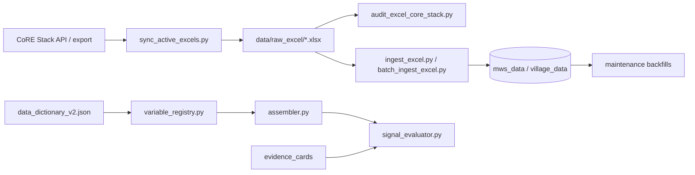

# Excel Source Update — New Columns, Sheets & Time Series

**Date:** 2026-06-15  
**Scope:** Process CoRE Stack Excel changes so new or extended data flows into diagnosis (ingest → registry → assembler → evidence cards)  
**Related:** [06-variable-naming-normalization.md](./06-variable-naming-normalization.md), [05-induct-new-pathway.md](./05-induct-new-pathway.md), `PREPROCESS.md`

---

## Purpose

CoRE Stack tehsil Excel exports evolve: new indicator columns, new worksheets, or additional years in time-series sheets. This plan defines the checks and code touchpoints so:

1. MongoDB `mws_data` / `village_data` reflect the new fields
2. The **variable registry** and **assembler** expose canonical names
3. Evidence card expressions remain valid (or are updated deliberately)
4. Time-series year extensions do not silently break trend / `[-1]` logic

---

## Source data flow



---

## Step 0 — Sync latest Excel files

```powershell
# Preview
.\.venv\Scripts\python.exe scripts\sync_active_excels.py --dry-run

# Copy active tehsil exports into data/raw_excel/
.\.venv\Scripts\python.exe scripts\sync_active_excels.py

# Scope to one tehsil
.\.venv\Scripts\python.exe scripts\sync_active_excels.py --state Maharashtra --district Yavatmal --tehsil Darwha --force
```

**Outputs:** copied files under `data/raw_excel/`, `data/raw_excel/sync_report.json`, optional `data/excel_core_stack_audit.json`.

---

## Step 1 — Audit Excel vs CoRE Stack (mandatory)

```powershell
.\.venv\Scripts\python.exe scripts\verify\audit_excel_core_stack.py --from-active
# or legacy nine tehsils:
.\.venv\Scripts\python.exe scripts\verify\audit_excel_core_stack.py --legacy-nine
```

**Review report for:**

- Missing / renamed worksheets
- Column header drift vs last ingest
- API geometry or stats mismatches
- Rows with null keys or duplicate UIDs

Fix upstream export issues before changing ingest code when possible.

---

## Step 2 — Classify the change

| Change type | Typical action | Evidence cards? |
|-------------|----------------|-----------------|
| **New column on existing sheet** | Extend parser + dictionary + resolver | Only if new variable used in framework/cards |
| **Renamed column** | Update parser mapping; add registry alias if needed | Re-run expression audit |
| **New optional sheet** | Add `sheet_to_dict(..., optional=True)` parser | If variables enter diagnosis |
| **New required sheet** | Add parser; document in dictionary | As needed |
| **Extra year in time-series sheet** | Re-ingest; verify `[-1]` / trend helpers | Usually **no** card change if expressions use latest year |
| **Corrected historical values** | Re-ingest affected tehsils | Re-run signal matrix if values shift materially |

---

## Step 3 — Update metadata (`data_dictionary_v2.json`)

For each new or renamed field:

```json
"new_variable_name": {
  "type": "static | time_series | nested_time_series | derived",
  "excel_sheet": "sheet_name",
  "excel_column": "Header As In Excel",
  "description": "...",
  "legacy_aliases": ["old_name_if_any"]
}
```

**Naming policy (plan 06):** Canonical names = dictionary names. Assembler resolvers and card expressions must use these names.

Reload metadata if framework references change:

```powershell
.\.venv\Scripts\python.exe scripts\load_metadata_to_mongo.py
```

---

## Step 4 — Update ingest (`scripts/ingest_excel.py`)

### Existing sheet, new column

1. Locate the parser (e.g. `parse_hydrological_annual`, `parse_change_detection`, `parse_village_socio`)
2. Map Excel header → Mongo sub-document path
3. For drought nested fields, route through `normalize_drought_causality()` / `source_key_map` in registry
4. For static change-detection scalars, align with `STATIC_CD_VARIABLES` in registry

### New sheet

1. Add `parse_<sheet>(rows, docs, ...)` following neighboring parsers
2. Call from `ingest_tehsil()` with `optional=True` if not all tehsils have it yet
3. Document sheet in `data_dictionary_v2.json`

### Known sheet inventory (reference)

| Sheet | Parser area |
|-------|-------------|
| `mws` | Core MWS identity + tehsils[] |
| `stream_order`, `mws_connectivity`, `terrain`, `dem` | MWS physical |
| `aquifer_vector`, `soge_vector`, `river`, `canal` | MWS vectors |
| `change_detection_*` | Static CD scalars |
| `hydrological_annual`, `hydrological_seasonal` | Water balance |
| `surfaceWaterBodies_annual`, `lulc_vector`, `croppingIntensity_annual` | Land / water use |
| `croppingDrought_kharif`, drought causality sheets | Drought nested series |
| `social_economic_indicator` | Village socio |
| `facilities_proximity`, `nrega_assets_village` | Village optional |

---

## Step 5 — Re-ingest affected tehsils

```powershell
# Single tehsil (force overwrite complete manifest)
.\.venv\Scripts\python.exe scripts\ingest_excel.py `
  --excel data/raw_excel/Maharashtra__Yavatmal__Darwha_data.xlsx `
  --state Maharashtra --district Yavatmal --tehsil Darwha --force

# Batch (synced catalog)
.\.venv\Scripts\python.exe scripts\batch_ingest_excel.py --from-active --force
```

**Post-ingest checks:**

```powershell
.\.venv\Scripts\python.exe scripts\verify\verify_ingest.py
.\.venv\Scripts\python.exe scripts\verify\spot_check_resolvers.py --uid <mws_uid>
```

---

## Step 6 — Backfill existing Mongo docs (if normalizers changed)

When ingest logic changes but full re-ingest of all tehsils is impractical:

```powershell
# Drought nested key normalization
.\.venv\Scripts\python.exe scripts\maintenance\backfill_mws_variable_names.py

# Multi-tehsil tehsils[] array (if mws sheet membership changed)
.\.venv\Scripts\python.exe scripts\maintenance\backfill_mws_tehsils.py
```

Scripts are idempotent — safe to re-run.

---

## Step 7 — Assembler & registry

1. Add resolver in `runtime/services/assembler.py` (canonical key)
2. If nested or derived, extend `runtime/services/variable_registry.py` helpers
3. Update `runtime/services/mws_enrich.py` if village aggregation or facility distances need new fields
4. Export case-study snapshots if used in audits:

```powershell
.\.venv\Scripts\python.exe scripts\export_case_study_mws_variables.py
```

---

## Step 8 — Time-series year extension checks

Most card expressions use **latest year** (`variable[-1]`, trend helpers in `derived_variables.py`). An extra Excel year usually:

- Extends Mongo year keys automatically on re-ingest
- Shifts `[-1]` to the new latest year — **intended behavior**
- May change trend slopes (`trend_*` derived variables)

**Mandatory checks after year extension:**

```powershell
# Registry + expression shape audit
.\.venv\Scripts\python.exe scripts\verify\audit_variable_registry.py

# Full signal eval on case-study MWS exports
.\.venv\Scripts\python.exe scripts\verify\evaluate_signal_matrix.py

# Derived variable unit tests
.\.venv\Scripts\python.exe scripts\test\test_derived_variables.py
.\.venv\Scripts\python.exe scripts\test\test_variable_registry.py
```

**Manual spot-check:**

- Pick 2–3 MWS with long series; confirm latest-year values in UI info panel match Excel
- Confirm drought nested latest-year scores in `present_variables` eval context

If cards hard-code a year literal (rare), update expressions via `normalize_evidence_card_expressions.py`.

---

## Step 9 — Evidence card updates (when variables enter diagnosis)

Required when **new variables** appear in:

- `diagnosis_framework.json` diagnostic_variables, or
- Existing card expressions referencing previously missing data

**Not required** for pure year extension if expressions already use `[-1]` / registry trend helpers.

### 9a. Framework alignment

```powershell
.\.venv\Scripts\python.exe scripts\patch_framework_expression_vars.py --dry-run
```

### 9b. Regenerate or patch cards

**Option A — new pathway / major new signals:** run pathway induction (plan 05) for that prefix.

**Option B — expression fixes only:**

```powershell
.\.venv\Scripts\python.exe scripts\maintenance\normalize_evidence_card_expressions.py --dry-run
.\.venv\Scripts\python.exe scripts\maintenance\normalize_evidence_card_expressions.py --apply
.\.venv\Scripts\python.exe scripts\reload_evidence_cards.py
```

### 9c. Follow-up wiring (if new qualitative questions)

```powershell
.\.venv\Scripts\python.exe scripts\maintenance\wire_follow_up_signals.py --prefix <pathway> --dry-run
.\.venv\Scripts\python.exe scripts\maintenance\wire_follow_up_signals.py --prefix <pathway> --apply
```

### 9d. Gates

```powershell
.\.venv\Scripts\python.exe scripts\verify\audit_variable_registry.py
.\.venv\Scripts\python.exe scripts\verify\evaluate_signal_matrix.py
.\.venv\Scripts\python.exe scripts\maintenance\audit_evidence_card_prompts.py
.\.venv\Scripts\python.exe scripts\test\test_signal_evaluator_matrix.py
```

**Baseline:** 0 hard runtime errors on the signal matrix.

---

## Step 10 — Frontend / panel updates (if new charts)

When new variables need visualization:

1. Add chart spec to `metadata/reference_standards.json`
2. Add panel trigger keys for confirmed pathways
3. Wire charts in `frontend/src/components/charts/MwsCharts.tsx` and `InfoPanel.tsx`
4. Add labels in `frontend/src/utils/panelUpdates.ts`

Run `scripts/test/test_panel_updates.py` after adding mappings.

---

## Checklist summary

| # | Step | Command / artifact |
|---|------|-------------------|
| 0 | Sync Excel | `sync_active_excels.py` |
| 1 | Audit source | `verify/audit_excel_core_stack.py` |
| 2 | Classify change | (this doc § Step 2) |
| 3 | Update dictionary | `metadata/data_dictionary_v2.json` |
| 4 | Update ingest | `scripts/ingest_excel.py` |
| 5 | Re-ingest | `ingest_excel.py` / `batch_ingest_excel.py` |
| 6 | Backfill | `maintenance/backfill_*.py` if needed |
| 7 | Resolvers | `assembler.py`, `variable_registry.py` |
| 8 | Year extension QA | `audit_variable_registry.py`, `evaluate_signal_matrix.py` |
| 9 | Cards (if needed) | normalize → reload → wire follow-ups |
| 10 | Frontend (if needed) | reference_standards + charts |

---

## Audit artifacts (keep under version control)

| Path | Produced by |
|------|-------------|
| `data/excel_core_stack_audit.json` | `audit_excel_core_stack.py` |
| `data/raw_excel/sync_report.json` | `sync_active_excels.py` |
| `data/audits/variable_naming_<date>.json` | `audit_variable_registry.py` |
| `data/audits/` (signal matrix reports) | `evaluate_signal_matrix.py` |

Review audit JSON in PRs when Excel or ingest changes land.

---

## When *not* to change evidence cards

- Excel adds a new year to existing hydrological / LULC / drought sheets and expressions already use latest-index or trend helpers
- Column rename handled entirely by ingest alias → canonical registry name (re-run audits only)
- Variable remains `not_available` in framework (no Excel backing expected)

Always re-run **signal matrix** and **registry audit** anyway — cheap regression gates.
