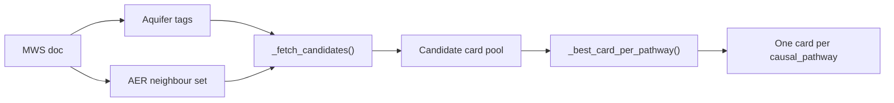
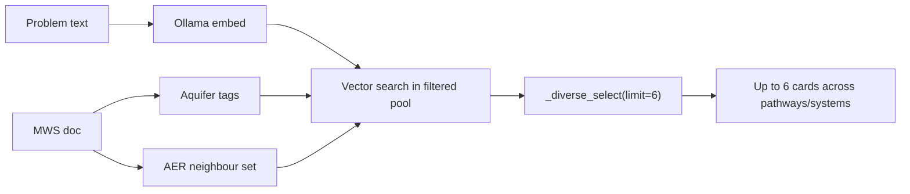

# AER retrieval neighbours — how they were decided

> **Status:** Reference documentation (implemented)  
> **Created:** 2026-06-07  
> **Code:** `runtime/services/retriever.py` (`AER_RETRIEVAL_NEIGHBORS`), `runtime/services/aer_alignment.py`

---

## Purpose

Evidence cards are tagged with one or more **NBSS-LUP Agro-Ecological Region (AER)** codes (`aer_tags` on each card). Each MWS gets a single **dominant AER** from spatial lookup (`nbss_lup_aer_code` on `mws_data`, via point-in-polygon over `data/India_AER_NBSS_LUP.geojson`).

Retrieval must find cards relevant to the MWS’s agro-ecological context. Many AERs do not yet have a full dedicated card set for every pathway × context cluster. **Neighbour expansion** widens the Mongo filter to physiographically adjacent AERs so retrieval does not fall back to unrelated regions (e.g. AER-3 Deccan must not pull AER-9 Indo-Gangetic alluvial cards).

---

## What is *not* automatic

Neighbour sets are **not** computed from polygon adjacency on the map. They are a **hand-curated table** in `AER_RETRIEVAL_NEIGHBORS`, maintained alongside evidence-card coverage audits (`scripts/maintenance/audit_aer_card_coverage.py`).

Design inputs:

1. **NBSS-LUP physiography** — region names and rainfall/LGP bands in `metadata/reference_standards.json`.
2. **Evidence card coverage** — which AERs have direct cards vs rely on proxies (`data/reports/aquifer_aer_cluster_matrix.csv`, gap JSON).
3. **Aquifer coherence** — retrieval also filters by inferred ACWADAM aquifer tags; neighbour AERs should be plausible hydrogeological proxies when direct cards are missing.
4. **Explicit anti-patterns** — e.g. peninsular hard-rock AERs must not expand into Indo-Gangetic alluvial AERs.

---

## How the retrieval set is built

For MWS AER code `AER-k`:

```python
neighbors = AER_RETRIEVAL_NEIGHBORS.get(aer, [aer])
ordered = dedupe([aer, *neighbors])  # MWS AER always first
```

This list is exposed to the API as `retrieval_aer_tags` and used in Mongo queries:

```python
{"aquifer_tags": ..., "aer_tags": {"$in": ordered}}
```

If aquifer + AER filter returns no vector hits, the retriever retries **AER-only** (same neighbour set, aquifer filter dropped) — never global retrieval without AER constraint.

---

## Shared inputs: dominant aquifer and AER

Both retrieval routes start from the same MWS context:

| Step | Source | Output |
|------|--------|--------|
| **1. Dominant AER** | Point-in-polygon over NBSS-LUP boundaries (`aer_lookup.py`) | `nbss_lup_aer_code` (e.g. `AER-6`) |
| **2. Dominant lithology → ACWADAM** | `aquifer.lithology_percent` + AER disambiguation (`aquifer_classification.py`) | `acwadam_class` (e.g. `volcanic`, `crystalline_basement`, `alluvium`) |
| **3. Card aquifer filter** | `card_aquifer_tags_for_mws()` / `card_aquifer_tags()` | Mongo `aquifer_tags` filter (e.g. `hard_rock`, or `coastal` + `alluvium` for AER-18 alluvium) |
| **4. AER retrieval set** | `_aer_tags_for_retrieval()` + `AER_RETRIEVAL_NEIGHBORS` | Ordered list ending in neighbour expansion (e.g. `AER-6, AER-3, AER-7, AER-8`) |

Mongo pre-filter for both routes:

```python
{"aquifer_tags": ..., "aer_tags": {"$in": retrieval_aer_tags}}
```

If that returns nothing, `_fetch_candidates` falls back to **AER-only** (same neighbour set, aquifer filter dropped).

Evidence cards are authored per **CONTEXT_CLUSTER** suffix (`__001` … `__017` on `card_id`). Cluster eligibility (aquifer type ∩ AER tag overlap) is documented in the 300-row matrix export — see below.

---

## Non-LLM route — identify cards for an MWS

**When:** `want_llm_opinion: false` (default server-only diagnosis).  
**Entry:** `load_mws_scoped_evidence_cards()` in `retriever.py`, called from `POST /api/query` in `query.py`.

**Flow:**



1. **No embedding** — all matching cards are loaded from Mongo (subject to aquifer + AER filters).
2. **`_best_card_per_pathway`** — for each distinct `causal_pathway`, keep exactly one card:
   - Prefer cards whose `aer_tags` include the **MWS’s exact AER** (`_card_scope_score`: direct AER match first).
   - Tie-break: highest `card_id` (stable ordering).
3. **Result:** typically 8 pathway cards (one per pathway in the framework), each with a cluster suffix on `card_id` (e.g. `…__groundwater_stress__006` for Deccan semi-arid).

This route is deterministic and exhaustive over the filtered pool — it does not rank by semantic similarity to a user question.

**Follow-ups:** card ids from the initial turn are **frozen** via `load_evidence_cards_by_ids()`; aquifer/AER filters are not re-run unless the session is restarted.

---

## LLM route — identify cards for an MWS

**When:** `want_llm_opinion: true`.  
**Entry:** `retrieve_evidence_cards()` in `retriever.py`.

**Flow:**



1. **Embed** the retrieval query (user problem, or default probe when empty).
2. **Same aquifer + AER neighbour filter** as non-LLM (`_fetch_candidates` / Atlas vector search).
3. **Score** by cosine similarity to the query embedding; apply **`DIRECT_AER_MATCH_WEIGHT`** (+0.06) when card `aer_tags` include the MWS AER.
4. **`_diverse_select`** — greedy selection of up to **6** cards, favouring diversity across `production_system` and `causal_pathway` (not one-card-per-pathway).
5. Attach paper **citations** per selected card.

The LLM reviewer (`run_llm_reviewer_diagnosis`) then interprets signals for whatever subset was retrieved; pathways without a retrieved card may remain uncertain.

**Follow-ups:** same frozen card-id behaviour as non-LLM after the initial turn.

---

## Comparison

| Aspect | Non-LLM | LLM |
|--------|---------|-----|
| Function | `load_mws_scoped_evidence_cards` | `retrieve_evidence_cards` |
| Embedding | None | Required (Ollama) |
| Cards returned | One per `causal_pathway` in pool | Up to 6, diversity-selected |
| Selection criterion | Exact AER on card, then `card_id` | Vector similarity + AER bonus + diversity |
| User question | Optional (ignored for retrieval) | Drives embedding / ranking |
| Diagnosis | `run_server_diagnosis` | `run_llm_reviewer_diagnosis` |

Both routes share **`AER_RETRIEVAL_NEIGHBORS`**, aquifer inference, and AER-only fallback.

---

## Aquifer × AER cluster matrix (300 rows) and `clusters.tif`

### The CSV export

**Script:** `scripts/maintenance/export_aquifer_aer_cluster_matrix.py`  
**Output:** `data/reports/aquifer_aer_cluster_matrix.csv` (300 rows) + `data/reports/aquifer_aer_cluster_gaps.json`

**Grid:** **15 dominant lithologies** (`LITHOLOGY_COLUMNS` in `aquifer_classification.py`, including `None`) × **20 NBSS-LUP AERs** (`AER-1` … `AER-20`) = **300 rows**.

Each row simulates what happens for an MWS with that lithology + AER:

1. Infer **ACWADAM class** (`infer_acwadam_class`) → **card aquifer filter** (`card_aquifer_tags`).
2. Build **AER retrieval neighbour set** (same table as runtime).
3. List **eligible CONTEXT_CLUSTERS** — clusters whose `aquifer_types` overlap the card filter **and** whose `aer_tags` intersect the neighbour set.
4. Run **`load_mws_scoped_evidence_cards`** (non-LLM path) against live Mongo and record which cluster suffix each pathway resolves to.

**Key CSV columns:**

| Column | Meaning |
|--------|---------|
| `dominant_lithology`, `mws_aer` | Row keys |
| `acwadam_class`, `card_aquifer_filter` | Inferred aquifer → Mongo filter |
| `aer_retrieval_neighbors` | Expanded AER set used at retrieval |
| `eligible_cluster_suffixes`, `eligible_cluster_count` | CONTEXT_CLUSTERS that match aquifer ∩ AER |
| `preferred_cluster_suffix` | Cluster whose `aer_tags` includes exact MWS AER (if any) |
| `non_llm_resolved_cluster_suffix` | Cluster suffix after full non-LLM simulation (`001`–`017`, `mixed`, or empty) |
| `non_llm_pathway_cluster_map` | Per-pathway cluster assignment (e.g. `groundwater_stress=006`) |
| `non_llm_retrieval_pool` | `aquifer+aer` or `aer_only_fallback` |
| `mws_count` | Real MWS in Mongo with that (lithology, AER) pair |

**Gap analysis** (`aquifer_aer_cluster_gaps.json`, snapshot at export time):

- **22 (AER, aquifer) pairs** with **no eligible CONTEXT_CLUSTER** — non-LLM relies on **AER-only fallback** (wrong aquifer on card, but geographically proximate).
- **21 pairs** with **multiple eligible clusters** — non-LLM may split pathways across suffixes or pick by exact AER / `card_id`.
- `cluster_catalog` — pathways present in Mongo per cluster suffix.

Regenerate after card or neighbour changes:

```bash
python scripts/maintenance/export_aquifer_aer_cluster_matrix.py
```

### `data/clusters.tif` — spatial cluster raster

**Built from:** the 300-row matrix logic — each real MWS is assigned a **context cluster id** by combining:

- its **spatial AER** (`nbss_lup_aer_code`), and  
- its **dominant lithology / ACWADAM aquifer** (same inference as the CSV rows),

then looking up the non-LLM resolved cluster (typically `non_llm_resolved_cluster_suffix`, or the mode across pathways when `mixed`).

**Raster encoding:**

| Pixel value | Maps to |
|-------------|---------|
| `0` | No data |
| `1` … `17` | CONTEXT_CLUSTER suffix `001` … `017` |

**Styling:** `data/clusters.qml` — QGIS palette matching cluster labels (e.g. `1` = Deccan basalt semi-arid, `3` = Indo-Gangetic alluvial sub-humid).

**Use in the stack:**

- Serves as the **cluster context map** for the signal editor (`CLUSTER_COG_URL` / local `data/clusters.tif`).
- Lets reviewers click a location and read cluster id **1–17** without re-running lithology × AER simulation.
- Complements per-MWS diagnosis: runtime card selection still goes through `retriever.py`; the raster is the **geographic face** of the matrix export.

There is no raster-build script in this repo yet; the TIFF was produced externally from the matrix export and MWS/AER spatial data. Rebuilding the raster after matrix or neighbour updates is a manual / GIS step until automated.

---

## Ranking after fetch

Neighbour expansion only affects **which cards are eligible**. Among candidates:

| Mechanism | Effect |
|-----------|--------|
| Vector similarity | Primary score from embedding match to query |
| `DIRECT_AER_MATCH_WEIGHT` (+0.06) | Boost cards whose `aer_tags` include the **MWS’s own** AER over neighbour-proxy cards |
| System / pathway diversity weights | Spread results across production systems and causal pathways |

UI alignment labels (`frontend/src/utils/pathwayLabels.ts`, `runtime/services/aer_alignment.py`):

| Label | Condition |
|-------|-----------|
| **exact** | MWS AER ∈ card `aer_tags` |
| **neighbor** | MWS AER ∉ card tags, but card tags ∩ `retrieval_aer_tags` ≠ ∅ |
| **mismatch** | No overlap with retrieval set |

---

## Neighbour table by region (rationale summary)

Full table: `AER_RETRIEVAL_NEIGHBORS` in `retriever.py`. Summary of grouping logic:

| Region group | AERs | Neighbour logic |
|--------------|------|-----------------|
| **Western Himalaya cold arid** | AER-1 | Self + AER-14 (foothills), AER-2/4 (arid/semi-arid plains transition) |
| **Arid west** | AER-2 | Self + AER-4, AER-5 (Rajasthan–Gujarat–Malwa belt) |
| **Peninsular semi-arid block** | AER-3, 6, 7, 8 | Mutual pool — Deccan, Eastern Ghats, interior Karnataka/AP; shared hard-rock / volcanic aquifer narratives |
| **Northern semi-arid / arid plains** | AER-4, 5 | Cross-link arid west (2), Malwa (5), Indo-Gangetic fringe (9) |
| **Indo-Gangetic & Bundelkhand** | AER-9, 10, 13 | Sub-humid alluvial and Bundelkhand sedimentary belt; AER-10 also pulls peninsular sub-humid (7, 8) as hard-rock proxy where cards thin |
| **Eastern plateau** | AER-11, 12 | Each other + AER-10 + peninsular (7, 8) until dedicated eastern-plateau cluster cards are complete |
| **Himalayan / NE humid** | AER-14, 16, 17 | Himalayan foothills/perhumid chain; AER-17 also links Chhota Nagpur (11) and sub-humid plateau (10) as weak proxies |
| **Delta & Bengal plain** | AER-15 | AER-13, 9, coastal (18), west coast humid (19) |
| **Coastal & islands** | AER-18, 19, 20 | Eastern/western coastal humid belt + island (20 → 19, 18) |

Comments in code flag **intentional weak proxies** (e.g. AER-11/12 → peninsular 7/8) until pathway-specific cards exist for those regions.

---

## Worked examples

**AER-3 (Deccan hot arid)** — retrieval set: `AER-3, AER-6, AER-7, AER-8`.  
Excludes AER-9 (Indo-Gangetic). Verified in `scripts/test/test_retriever_aer.py`.

**AER-11 (Chhattisgarh eastern plateau)** — retrieval set: `AER-11, AER-12, AER-10, AER-7, AER-8`.  
Direct AER-11 cards preferred; if missing, pulls structurally similar sub-humid plateau / hard-rock cards.

**AER-6 (Vidarbha / Marathwada Deccan semi-arid)** — same peninsular block as AER-3/7/8; aligns with CONTEXT_CLUSTER `001` (Deccan basalt semi-arid) card generation.

---

## Relationship to CONTEXT_CLUSTERS

`CONTEXT_CLUSTERS` in `scripts/generate_evidence_cards.py` maps **context cluster suffixes 001–017** to `aer_tags` lists used when **authoring** cards (e.g. cluster 001 → `AER-3`, `AER-6`).

`AER_RETRIEVAL_NEIGHBORS` maps **MWS dominant AER** → expanded search set at **runtime**.

They are related but not identical: a card may list multiple AER tags for a cluster; retrieval neighbours ensure an MWS in a poorly covered AER still finds geographically plausible cards.

---

## Maintenance

When adding cards for a new region or pathway:

1. Run `scripts/maintenance/audit_aer_card_coverage.py` — flags AERs with zero/weak neighbour pools.
2. Run `scripts/maintenance/export_aquifer_aer_cluster_matrix.py` — aquifer × AER × cluster simulation gaps.
3. Adjust `AER_RETRIEVAL_NEIGHBORS` only when physiographic proxying is justified; prefer adding real cards over widening neighbours.
4. Update `scripts/test/test_retriever_aer.py` for any changed sets.

---

## Related files

| File | Role |
|------|------|
| `runtime/services/retriever.py` | Neighbour table, `_aer_tags_for_retrieval`, candidate fetch |
| `runtime/services/aer_alignment.py` | exact / neighbor / mismatch classification |
| `runtime/services/aer_lookup.py` | MWS → dominant AER (spatial, not neighbours) |
| `runtime/services/aquifer_classification.py` | Lithology → ACWADAM → card aquifer tags |
| `runtime/routers/query.py` | Chooses non-LLM vs LLM retrieval on `want_llm_opinion` |
| `scripts/maintenance/export_aquifer_aer_cluster_matrix.py` | 300-row matrix + gap JSON |
| `data/reports/aquifer_aer_cluster_matrix.csv` | Lithology × AER simulation export |
| `data/reports/aquifer_aer_cluster_gaps.json` | Pairs with 0 or >1 eligible clusters |
| `data/clusters.tif`, `data/clusters.qml` | Spatial cluster raster + palette (from matrix) |
| `metadata/reference_standards.json` | Canonical AER names and dominant aquifers |
| `scripts/maintenance/audit_aer_card_coverage.py` | Coverage audit using neighbour pools |
| `frontend/src/utils/pathwayLabels.ts` | UI labels for AER alignment |
