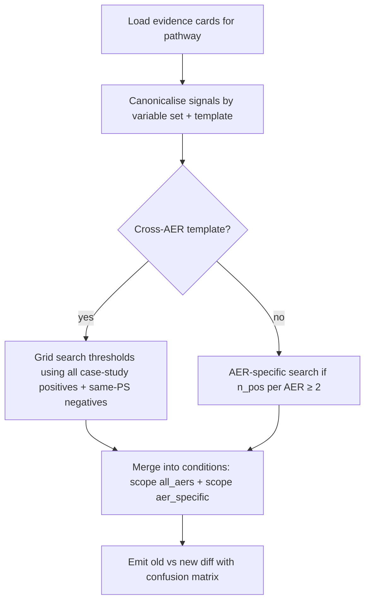
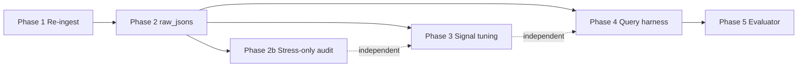

# Re-ingest, case-study raw JSONs, signal tuning, and query-bank evaluation

> **Status:** Archived — pick up after Plan 15 (Claude evidence-card review) completes  
> **Created:** 2026-06-07  
> **Prerequisite:** Plans 09 (Excel source update), 05 (pathway induction), 10 (server MCQ / dual opinion), **Plan 15** (evidence cards reviewed and reloaded)  
> **Reference artifacts:** `scripts/reference/expression_tuning_algorithm_v2.md`, `scripts/reference/query_bank.json`, `scripts/reference/evaluation_rubric.json`

---

## Original request (retained)

Make a new plan for some tasks that we will do later:

- Reingest all raw excels
- Update the raw_jsons for a few case studies listed `@metadata/case_study_locations_v2.json`
- These case studies have confirmed pathways for which they are listed. `@scripts/reference/expression_tuning_algorithm_v2.md` is a reference doc with code snippets describing how the signals in the corresponding evidence cards for these case studies can be fine tuned so that they are able to successfully confirm these case studies for the pathways known to exist there, and not confirm for case studies in the same production system in other pathways. Implement this fine tuning algorithm yourself and generate an output of the old signals and new signals that can be reviewed. Note that the case studies also include those for which pathways have not been built as yet; these can be ignored.
- `@scripts/reference/query_bank.json` is a bank of queries for different personas. These queries should be run automatically through the non-llm mode, the llm mode with ollama, and the llm mode with claude. An analysis should be produced using this rubric `@scripts/reference/evaluation_rubric.json` of the quality of the response. Note that the non-llm mode does not accept any query, so it should be run directly and the response can be analyzed regardless to see if helps provide any insights for the queries put up to it. The analysis against the rubric needs to be done by an evaluator that will need to be built, and will use LLMs for the analysis. The evaluator can also suggest how especially for the no-llm mode the server's response can be improved so that it can cater better to queries such as the ones its current response was evaluated against. Note that the query bank contains queries that would require other pathways not built so far. Ignore these queries for now.

---

## Problem statement

Three data-quality gaps and two evaluation gaps block trustworthy case-study validation and systematic quality measurement:

1. **Stale MWS data in Mongo.** Spot checks (`scripts/verify/spot_check_drought_ingest.py`, 11 MWS) show 9/11 match current Excel; Darwha and Gande have mild/moderate week mismatches consistent with an older ingest. A full re-ingest is needed before signal tuning or query evaluation.
2. **Case-study raw JSON snapshots are outdated.** `data/raw_jsons/` holds assembler-resolved variable bundles for 32 MWS tied to `case_study_locations_v2.json`. These must be regenerated after re-ingest so tuning and evaluation use current values.
3. **Evidence-card thresholds are not calibrated to confirmed case studies.** The v2 tuning algorithm (pathway-first, cross-AER + AER-specific) exists as a reference doc only — not as executable code. Thresholds that fail on sparse positives (e.g. drought n=4) need a reviewable old→new diff before any card JSON is applied.
4. **No automated query-bank harness.** Thirty persona queries exist; no script runs them in three LLM modes and scores responses.
5. **No LLM evaluator.** `evaluation_rubric.json` defines D1–D6, persona adjustments, error flags, and output schema — but nothing invokes it.

---

## Scope boundaries

### In scope

| Area | Include |
|------|---------|
| Re-ingest | All 388 tehsil Excel files in `data/raw_excel/` via `batch_ingest_excel.py --force` |
| raw_jsons | All unique MWS IDs referenced in `case_study_locations_v2.json` with a **built** causal pathway (not `__stress_only__`) |
| Signal tuning | Pathways that have both (a) evidence cards in `metadata/evidence_cards/` and (b) ≥1 case study in the index |
| Stress-only audit | `__stress_only__` case studies under **Agriculture/water_scarcity** and **Socio_Economic/economic_hardship** only — run server diagnosis, report flagged pathways (not used for tuning) |
| Query eval | Queries where **every** `expected_pathway_candidates` entry exists in `diagnosis_framework.json` (23 of 30 today) |

### Out of scope (explicitly deferred)

| Area | Exclude | Reason |
|------|---------|--------|
| Case studies | Other `__stress_only__` rows (ntfp_decline, crop_failure, livestock_decline, low_yield) | Out of scope for stress-only audit |
| Case studies | Pathways listed in index but not yet in framework | Not built |
| Query bank | Q006, Q008, Q009, Q011, Q015, Q026, Q028 (need `market_access_gap` or `land_degradation`) | Pathways not built |
| Signal tuning | Auto-applying tuned expressions to evidence cards | Human review gate first |
| Query eval | Follow-up conversation loops (multi-turn MCQ) | Phase 1 = initial diagnosis response only |

### Case-study inventory (built pathways only)

From `metadata/case_study_locations_v2.json` (60 rows, 32 unique MWS):

| Pathway | Case studies | Evidence cards (approx.) |
|---------|-------------:|-------------------------|
| `NTFP_Forest_Biodiversity/biodiversity_loss/forest_degradation` | 7 | cluster variants |
| `NTFP_Forest_Biodiversity/biodiversity_loss/encroachment` | 6 | cluster variants |
| `Agriculture/water_scarcity/rainfed_risk` | 5 | — |
| `Agriculture/water_scarcity/irrigation_challenges` | 5 | — |
| `Agriculture/water_scarcity/drought` | 4 | 17 cards (reference doc) |
| `Livestock/livestock_decline/fodder_shortage` | 4 | — |
| `Livestock/livestock_decline/pasture_degradation` | 4 | — |
| `Agriculture/crop_failure/soil_degradation` | 3 | — |
| `NTFP_Forest_Biodiversity/biodiversity_loss/genetic_erosion` | 3 | — |
| `Agriculture/crop_failure/chemical_dependence` | 2 | — |
| `Livestock/livestock_decline/water_scarcity_livestock` | 1 | — |
| `NTFP_Forest_Biodiversity/biodiversity_loss/forest_fire` | 1 | — |

**12 built pathways · 45 case-study rows · 32 unique MWS**

---

## Phase 1 — Full Excel re-ingest

### Goal

Refresh all `mws_data` documents from current `data/raw_excel/*.xlsx` so Mongo matches source workbooks (fixing known drought mismatches and any other drift).

### Steps

| Step | Action | Command / artifact |
|------|--------|-------------------|
| 1a | Pre-flight: count manifests vs Excel catalog | `resolve_catalog()` from `scripts/lib/tehsil_excel_catalog.py` |
| 1b | Snapshot current drought spot-check baseline | `python scripts/verify/spot_check_drought_ingest.py` → save to `reports/drought_spot_check_pre_reingest.json` |
| 1c | Batch re-ingest with force | `python scripts/batch_ingest_excel.py --force` |
| 1d | Optional: skip geometry if CoRE Stack API unavailable | `--skip-geometries` |
| 1e | Post-flight spot check | Same script → `reports/drought_spot_check_post_reingest.json` |
| 1f | Verify ingest completeness | `python scripts/verify/verify_ingest.py` |

### Acceptance criteria

- All catalogued tehsils show `ingest_manifest.status == complete` (or documented failures in `reports/reingest_failures.json`).
- Darwha (`4_100672`) and Gande (`12_306338`) drought weeks match Excel (0 mismatches).
- No regression on previously matching spot-check MWS.

### Notes

- `ingest_excel.py` uses `--force` to bypass manifest short-circuit.
- Re-ingest does **not** reload metadata (`diagnosis_framework`, evidence cards) — only `mws_data` and related geometry collections.
- Estimated runtime: hours for 388 tehsils (parallelisation optional follow-up).

---

## Phase 2 — Regenerate case-study raw JSONs

### Goal

Update `data/raw_jsons/{mws_id}.json` for every case-study MWS with a built pathway, using post-re-ingest Mongo data.

### Steps

| Step | Action | Command / artifact |
|------|--------|-------------------|
| 2a | Extend or run existing exporter | `python scripts/export_case_study_mws_variables.py` |
| 2b | Filter export to built-pathway MWS only | Add `--built-pathways-only` flag (skip `__stress_only__` and unmapped pathways) |
| 2c | Write diff summary | Compare file hashes / key scalar fields before vs after → `reports/raw_jsons_refresh_summary.json` |
| 2d | Validate assembler coverage | Each export includes `present_variables`, `derived_variables`, `location_context`, `case_study_refs` |

### Output shape (existing convention)

```json
{
  "uid": "2_15086",
  "case_study_refs": [{ "case_study_id": 263, "production_system": "...", "pathway_id": "drought" }],
  "present_variables": { "...": "..." },
  "derived_variables": { "...": "..." },
  "location_context": { "area_ha": 1234, "nbss_lup_aer_code": "AER-6", ... }
}
```

### Acceptance criteria

- 32 JSON files updated (or count matching unique MWS in built-pathway case studies).
- Each file's `case_study_refs` align with `case_study_locations_v2.json`.
- Variables used by drought tuning (`drought_weeks_severe`, `drought_weeks_moderate`, `dry_spell_weeks`, etc.) present and non-null for drought positives.

---

## Phase 2b — Stress-only case study pathway audit

### Goal

Run **server-only** diagnosis (current signal rules, no LLM, no user query) for `__stress_only__` case studies under **water_scarcity** and **economic_hardship**. Record which pathways the server **confirms** or marks **uncertain** for each MWS. This is diagnostic only — results inform whether evidence rules are over-triggering sibling pathways; **not** an input to signal fine-tuning.

### Case studies in scope

| Stress | Production system | MWS IDs | Count |
|--------|-------------------|---------|------:|
| `water_scarcity` | Agriculture | `1_34623`, `12_61845`, `4_102533`, `12_374565`, `15_33653` | 5 |
| `economic_hardship` | Socio_Economic | `5_60634`, `23_8185`, `22_13922` | 3 |

These entries have no named causal pathway in the field index — the audit checks what the **current rule set** infers anyway.

### Steps

| Step | Action | Command / artifact |
|------|--------|-------------------|
| 2b-a | New script | `scripts/verify/audit_stress_only_case_studies.py` |
| 2b-b | For each MWS: load doc from Mongo, build variable bundle, call `run_server_diagnosis()` | Same pipeline as live `/api/diagnosis/query` with `want_llm_opinion=false` |
| 2b-c | Capture per MWS | `confirmed_pathways`, `uncertain_pathways`, `ruled_out` (if exposed), production system of each pathway |
| 2b-d | Cross-tab | Flag pathways confirmed on ≥2 MWS within same stress group; highlight Agriculture water pathways on economic_hardship MWS (cross-stress false positives) |
| 2b-e | Write report | `reports/stress_only_pathway_audit.json` + `reports/stress_only_pathway_audit.md` |

### Report columns (per MWS)

- `mws_id`, `case_study_id`, `observed_stress`, `tehsil` / `state`
- `confirmed_pathway_ids[]` with confidence
- `uncertain_pathway_ids[]` with confidence
- `unexpected`: pathways confirmed outside the case study's production system
- `water_scarcity_siblings`: for water_scarcity MWS, which of `{drought, groundwater_stress, rainfed_risk, irrigation_challenges}` fired

### Acceptance criteria

- All 8 MWS processed without error.
- Report lists every confirmed/uncertain pathway per MWS.
- Summary section counts how often each Agriculture water_scarcity pathway confirms on the 5 stress-only water MWS (expect multiple candidates — document which dominate).
- No evidence card or threshold changes in this phase.

### Notes

- Run after Phase 1 re-ingest (or on current Mongo if re-ingest is pending) so variable values are fresh.
- Do **not** include these MWS in Phase 3 tuning positives/negatives.

---

## Phase 3 — Signal expression fine-tuning (review-only output)

### Goal

Implement `expression_tuning_algorithm_v2.md` as executable Python. Produce a **review artifact** comparing old and proposed signal expressions — do **not** write to evidence cards until approved.

### New scripts

| Script | Purpose |
|--------|---------|
| `scripts/tuning/tune_pathway_signals.py` | CLI: `--pathway drought --production-system Agriculture --stress water_scarcity` |
| `scripts/tuning/expression_evaluator.py` | Safe `eval_signal()` with time-series `[-1]` indexing (from reference §4) |
| `scripts/tuning/template_canonicalisation.py` | `extract_template_and_thresholds`, template grouping (reference §2) |
| `scripts/tuning/grid_search.py` | Threshold grid search with TPR/FPR targets (reference §5–§7) |
| `scripts/tuning/corpus_builder.py` | Load raw_jsons + assign positive/negative labels (reference §3) |
| `scripts/tuning/report_writer.py` | Emit review JSON + human-readable Markdown |

### Algorithm summary (from reference v2)



### Label assignment rules

- **Positive:** MWS listed under the target `(production_system, observed_stress, causal_pathway)` in `case_study_locations_v2.json`.
- **Negative:** MWS in the **same production system** that is not a positive for **this** pathway (may be positive for a different pathway — important for specificity).
- **Feasibility gate:** Require `n_positives ≥ 2` for cross-AER tuning; document `INSUFFICIENT_DATA` when below (reference §7).

### Review output artifacts

| File | Contents |
|------|----------|
| `reports/signal_tuning/{pathway_id}_tuning_report.json` | Per-signal: `original_expression`, `proposed_expression`, `threshold_values`, confusion matrix, TPR/FPR, recommendation |
| `reports/signal_tuning/{pathway_id}_tuning_report.md` | Side-by-side old/new for human review |
| `reports/signal_tuning/summary.csv` | All pathways: n_pos, n_neg, signals updated, signals insufficient data |

### Pathway execution order (suggested)

1. **`drought`** — best documented in reference; 4 positives; 17 cards
2. **`rainfed_risk`**, **`irrigation_challenges`** — 5 positives each; Agriculture water_scarcity siblings (cross-pathway specificity test)
3. **`forest_degradation`**, **`encroachment`** — largest NTFP case-study sets
4. Remaining built pathways with ≥2 positives

### Acceptance criteria

- For drought: all 4 case-study MWS evaluate as **confirmed** under proposed thresholds; ≥50% of same-PS negatives for other water_scarcity pathways remain **not confirmed** (target from reference: minimise FP across sibling pathways).
- Review report includes `original_expression` and `proposed_expression` for every changed signal.
- No evidence card files modified in this phase.

### Post-review apply step (future, out of phase 3)

After human approval: script to patch `metadata/evidence_cards/*.json`, regenerate confirmation policies, reload cards to Mongo if applicable.

---

## Phase 4 — Query-bank diagnosis harness

### Goal

Automatically run eligible query-bank entries against a fixed MWS (or per-query MWS mapping) in three modes and capture full `DiagnosisResponse` JSON.

### MWS selection

Query bank entries do not specify MWS. Options (pick at implementation time):

| Option | Approach |
|--------|----------|
| A (recommended) | Map each query to a **canonical case-study MWS** for its primary `expected_pathway_candidates[0]` using `case_study_locations_v2.json` |
| B | Single demo MWS (e.g. `2_15086` drought) for all queries — simpler but less pathway-realistic |
| C | Add optional `mws_id` field to query bank (schema change) |

Document chosen mapping in `reports/query_eval/mws_mapping.json`.

### Three run modes

| Mode | API behaviour | Query text |
|------|---------------|------------|
| **server-only** | `want_llm_opinion=false`, empty problem string | Ignored — run landscape diagnosis without user question |
| **ollama** | `want_llm_opinion=true`, `LLM_PROVIDER=ollama` | Query text from query bank |
| **claude** | `want_llm_opinion=true`, `LLM_PROVIDER=anthropic` | Query text from query bank |

Implementation: call `runDiagnosisQuery` equivalent via HTTP (`POST /api/diagnosis/query`) or direct Python import of `reasoner.run_diagnosis`.

### New scripts

| Script | Purpose |
|--------|---------|
| `scripts/eval/run_query_bank.py` | Run all eligible queries × 3 modes; write responses |
| `scripts/eval/query_filter.py` | Exclude queries referencing unbuilt pathways |
| `scripts/eval/mws_mapping.py` | Build query → MWS map from case studies |

### Output layout

```
reports/query_eval/
  run_manifest.json          # timestamp, modes, query count, MWS mapping
  responses/
    Q001__server_only.json
    Q001__ollama.json
    Q001__claude.json
    ...
  excluded_queries.json      # Q006, Q008, ... with reason
```

### Acceptance criteria

- 23 eligible queries × 3 modes = 69 response files (or documented skips on API failure).
- Each response validates against `metadata/response_schema.json`.
- Server-only runs complete without requiring query text.

---

## Phase 5 — LLM rubric evaluator

### Goal

Build an evaluator that scores each `(query, mode, response)` tuple using `evaluation_rubric.json`, and produces improvement suggestions — especially for server-only mode.

### New scripts / modules

| Module | Purpose |
|--------|---------|
| `scripts/eval/evaluate_responses.py` | Batch evaluator CLI |
| `scripts/eval/evaluator_prompt.py` | Construct prompt from `evaluation_rubric.json` `example_evaluator_prompt` template |
| `scripts/eval/evaluator_client.py` | Call Claude or Ollama with temperature 0.1 |
| `scripts/eval/score_aggregator.py` | Weighted totals, persona adjustments, error-flag penalties |
| `scripts/eval/improvement_suggestions.py` | Extra prompt pass: "Given server-only response vs query intent, suggest panel/summary/solution improvements" |

### Evaluator inputs (per rubric meta)

1. User query text + persona + query ID  
2. `DiagnosisResponse` JSON  
3. MWS variable summary (flat key-value from raw_json or assembler)  
4. Full rubric JSON  

### Evaluator outputs

| File | Contents |
|------|----------|
| `reports/query_eval/scores/{query_id}__{mode}.json` | Conforms to `evaluator_output_schema` in rubric |
| `reports/query_eval/score_summary.csv` | query_id, mode, D1–D6, weighted_total, flags |
| `reports/query_eval/mode_comparison.md` | server-only vs ollama vs claude per query |
| `reports/query_eval/server_improvement_notes.md` | Aggregated suggestions for no-LLM panel quality |

### Server-only evaluation nuance

Non-LLM mode ignores the user query. Evaluator should:

- Still score D2, D3, D4, D6 against the **response as returned** (pathways, solutions, variable grounding).
- Score D1 with a **modified interpretation**: "Does the response contain information that *could* help answer the query, even though no query was supplied?"
- Add a dedicated **`server_query_alignment`** narrative field (not in base rubric) suggesting what panel summary / pathway ordering changes would better serve the query persona.

### Acceptance criteria

- All 69 (or available) responses receive evaluator JSON output.
- `weighted_total` computed per rubric formula with persona adjustments.
- Error flags EF1–EF5 checked programmatically where possible (variable name validation against `data_dictionary_v2.json`) before/alongside LLM scoring.
- Summary ranks modes and identifies lowest-scoring queries for iteration.

---

## Phase 6 — Integration and documentation

| Step | Action |
|------|--------|
| 6a | Update `scripts/README.md` with new tuning + eval scripts |
| 6b | Add `reports/.gitignore` entries if outputs should stay local |
| 6c | Document env vars: `LLM_PROVIDER`, `ANTHROPIC_API_KEY`, `OLLAMA_URL`, `MONGO_URI` |
| 6d | Optional: single orchestrator `scripts/run_phase14_pipeline.sh` chaining phases 1→5 |

---

## Dependency graph



Phases 3 and 4 can run in parallel after Phase 2. Phase 5 requires Phase 4 outputs only.

---

## Risk register

| Risk | Mitigation |
|------|------------|
| Re-ingest runtime (388 tehsils) | `--dry-run` first; log failures; resume via manifest |
| Sparse positives (drought n=4) | Reference doc flags low confidence; report `INSUFFICIENT_DATA`; do not auto-apply |
| Claude API cost for 23×3 eval runs | Batch eval; cache responses; evaluate with one model first |
| Server-only D1 scoring ambiguous | Document modified D1 interpretation; separate improvement pass |
| Sibling pathway false positives | Negatives = same production system, not same pathway; report per-negative pathway |
| Evidence card schema drift | Tuning reads live cards; report flags sig_03-style inconsistencies (reference §11) |

---

## Checklist (execution tracker)

### Phase 1 — Re-ingest
- [ ] Pre-reingest drought spot check saved
- [ ] `batch_ingest_excel.py --force` completed
- [ ] Post-reingest spot check: 0 mismatches on previously failing MWS
- [ ] `verify_ingest.py` passes

### Phase 2 — raw_jsons
- [ ] `export_case_study_mws_variables.py` run with built-pathway filter
- [ ] 32 MWS JSON files refreshed
- [ ] Refresh summary report written

### Phase 2b — Stress-only audit
- [ ] `audit_stress_only_case_studies.py` implemented
- [ ] 8 MWS (5 water_scarcity + 3 economic_hardship) diagnosed server-only
- [ ] `reports/stress_only_pathway_audit.json` + `.md` written

### Phase 3 — Signal tuning
- [ ] `expression_evaluator.py` + template + grid search implemented
- [ ] Drought pathway tuning report (JSON + MD)
- [ ] All 12 built pathways with case studies processed or marked insufficient data
- [ ] No evidence cards modified

### Phase 4 — Query harness
- [ ] Query filter: 23 eligible, 7 excluded documented
- [ ] MWS mapping documented
- [ ] 69 diagnosis responses captured

### Phase 5 — Evaluator
- [ ] Evaluator prompt + client implemented
- [ ] Per-response score JSON produced
- [ ] Mode comparison + server improvement notes written

### Phase 6 — Docs
- [ ] `scripts/README.md` updated

---

## Key file references

| Artifact | Path |
|----------|------|
| Case study index | `metadata/case_study_locations_v2.json` |
| Framework (built pathways) | `metadata/diagnosis_framework.json` |
| Tuning algorithm reference | `scripts/reference/expression_tuning_algorithm_v2.md` |
| Query bank | `scripts/reference/query_bank.json` |
| Evaluation rubric | `scripts/reference/evaluation_rubric.json` |
| Batch re-ingest | `scripts/batch_ingest_excel.py` |
| Case-study export | `scripts/export_case_study_mws_variables.py` |
| Drought spot check | `scripts/verify/spot_check_drought_ingest.py` |
| Stress-only audit | `scripts/verify/audit_stress_only_case_studies.py` (Phase 2b) |
| Evidence cards | `metadata/evidence_cards/` |
| Raw JSON snapshots | `data/raw_jsons/` |
