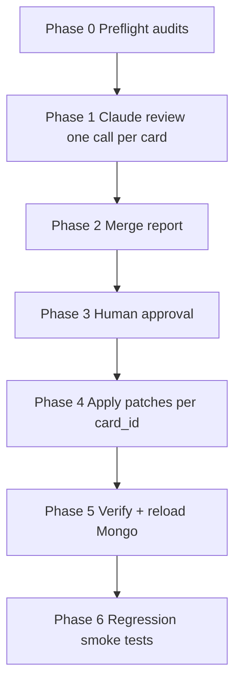

# Claude evidence-card corpus review

> **Status:** In progress — pilot Phases 0–2 complete (groundwater_stress, 17 cards); awaiting human approval (Phase 3)  
> **Created:** 2026-06-07  
> **Prerequisite:** Plan 13 (confirmation policy schema + deterministic audits), Plan 11 (signal editor read-only context)  
> **Runs before:** Plan 14 (re-ingest / tuning / query eval — **archived**, pick up after this plan completes and cards are stable)  
> **Tooling registry:** [00-tooling-registry.md](./00-tooling-registry.md)

---

## Original request (retained)

Build a new plan to use Claude to review all the evidence cards. The review should cover:

- For all expressions, whether their `qualitative_description` (if available) and mention in the `overall_reasoning_note` matches the actual expression in Python syntax, and whether the qualitative explanation field is captured correctly by the `severity` and `direction` fields.
- A review of the missing variable questions should also be done to check whether the question mode and corresponding choices (labels and their values and how they update the pathway) point in the same direction as in the overall reasoning note and the `how_answer_updates_diagnosis` qualitative field.
- The confirmation policy matches the qualitative `overall_reasoning_note`. Most important.
- For any mismatches on the expressions, alternative expressions should be given. Also, in some expressions values from the last year are used, e.g. `drought_weeks_severe[-1] >= 3`. Modifications should be suggested to these expressions to use the max value or mean over the last few years rather than just the latest year.
- For any mismatches on the confirmation policy, an alternative policy should be suggested.
- The review should produce a report of the issues and suggested changes, and once approved it would update the evidence cards, verify them, reingest them, and so on.
- Needless to say that the variables used in the expressions should match the ones in the data dictionary, set of derived variables, etc. And likewise the overall syntax of the evidence card should be correct.

**Do not execute until this plan is approved.**

---

## Problem statement

The corpus has **136 evidence cards** (`data/evidence_cards/raw/*.json`) with **809 signals** and **225 MCQ follow-up questions**. Cards mix:

- Executable Python expressions (`condition.expression`)
- Human prose (`qualitative_description`, `explanation`, `overall_reasoning_note`)
- Executable confirmation rules (`confirmation_policy`)
- Structured follow-up effects (`missing_variable_questions[].choices[].effects`)

Deterministic audits already exist (`audit_confirmation_policy.py`, `audit_follow_up_effects.py`, `expression_audit.py`) but they catch **syntax and structural** issues, not **semantic alignment** between prose and logic. Prior manual policy review (`reports/POLICY_FIXES_FOR_REVIEW.md`, `metadata/policy_corrections.json`) fixed 46 cards but did not systematically review expressions, severity/direction, or follow-up semantics across the full corpus.

Goal: a **Claude-assisted review pipeline** that produces an actionable report with suggested patches, gated by human approval before any card JSON is written or Mongo reloaded.

---

## Scope

### In scope

| Area | Review |
|------|--------|
| All 136 raw evidence cards | Full pass |
| `diagnostic_signals[]` | Expression ↔ prose ↔ severity/direction ↔ note mentions |
| `confirmation_policy` | Executable rules ↔ `overall_reasoning_note` (**priority 1**) |
| `missing_variable_questions[]` | MCQ mode, labels, `normalized`, `effects` ↔ `how_answer_updates_diagnosis` ↔ note |
| Card envelope | JSON schema, required fields, variable names vs registry |
| Temporal expressions | Flag `[-1]` / latest-year-only patterns; suggest multi-year alternatives where prose implies persistence |

### Out of scope (this plan)

| Area | Reason |
|------|--------|
| Re-tuning thresholds against case studies | Plan 14 (archived) — `expression_tuning_algorithm_v2.md` |
| Regenerating cards from papers | `generate_evidence_cards.py` |
| Changing runtime evaluator semantics | Separate plan if new expression helpers are needed |
| Editing `diagnosis_framework.json` | Not part of evidence cards |

---

## Existing assets to reuse

| Asset | Role in this plan |
|-------|-------------------|
| `metadata/evidence_card_schema.json` | Schema validation + reviewer context |
| `metadata/data_dictionary_v2.json` | Variable availability and definitions |
| `scripts/lib/expression_audit.py` | Preflight: AST names, drought keys, static index misuse |
| `scripts/lib/card_policy_utils.py` | Policy fingerprints, `derive_policy`, draft note from policy |
| `scripts/verify/audit_confirmation_policy.py` | Heuristic policy ↔ note checks (baseline) |
| `scripts/verify/audit_follow_up_effects.py` | MCQ `effects` shape validation |
| `scripts/reload_evidence_cards.py` | Post-approval: schema validate + Mongo reload + embed |
| `scripts/generate_evidence_cards.py` | **Pattern to follow:** one Claude call per card, full JSON in/out, `--resume` / `--limit` |
| Plan 13 | `confirmation_policy` v1 schema (`confirm_when`, `confidence_when`, `min_from_set`) |

---

## Review dimensions and rubric

Claude scores each dimension **pass / warn / fail** with cited card fields and a short justification.

### D1 — Expression ↔ qualitative prose (signals)

For each active signal with a non-empty `condition.expression`:

| Check | Fail if |
|-------|---------|
| **D1a** `qualitative_description` matches expression logic | Prose describes a different threshold, variable, or direction (e.g. prose says “4+ years negative delta_g” but expression counts 2 years) |
| **D1b** `explanation` consistent with expression | Explanation contradicts what the expression actually tests |
| **D1c** `overall_reasoning_note` mentions signal accurately | Note describes sig_X in a way that contradicts its expression (when sig_X is referenced) |
| **D1d** `severity` / `direction` fit the prose | e.g. `direction: amplifies` but prose/expression treated as primary confirm; `severity: high` for a weak peripheral indicator |
| **D1e** Variables in expression exist | Any name not in data dictionary + derived set + evaluator namespace (`expression_audit.all_known_names()`) |

**On fail/warn:** suggest `suggested_expression` (valid Python using known namespace) and optional `suggested_qualitative_description` / `suggested_severity` / `suggested_direction`.

### D2 — Temporal aggregation (signals)

Flag expressions using **latest-year-only** access when prose implies multi-year persistence:

| Pattern | Example | Review action |
|---------|---------|---------------|
| Series index `-1` only | `drought_weeks_severe[-1] >= 3` | Warn if note/prose says “recurrent”, “chronic”, “over several years” |
| Single-year compare | `delta_g_mm[-1] < 0` | Suggest `mean_annual_delta_g_mm`, trend helpers, or explicit window (e.g. count negative years) where supported |

**Constraint:** Suggested expressions must be evaluable by `runtime/services/signal_evaluator.py` today, or tagged `requires_evaluator_extension: true` for a follow-up task. Prefer existing derived names (`mean_*`, `trend_*`, `drought_*_return_period`) from `expression_audit._DERIVED_NAMES`.

### D3 — Confirmation policy ↔ overall_reasoning_note (**most important**)

| Check | Fail if |
|-------|---------|
| **D3a** Minimum confirm count | Note says “at least two primary signals” but `min_confirms_true` or `min_from_set.min` is 1 |
| **D3b** Primary signal set | Note lists sig_A, sig_B as primary but policy omits them or includes amplifiers |
| **D3c** Amplifiers not confirm-alone | Note says amplifier “does not confirm alone” but policy allows confirmation with only that signal true |
| **D3d** Confidence tiers | Note implies high confidence needs 3+ signals; `confidence_when` allows high at 1 |
| **D3e** Required groups | Note describes “SOGE **and** well depth” but policy has no `required_all` / `required_any` reflecting AND logic |

**On fail:** suggest full `suggested_confirmation_policy` object (v1 schema) plus `suggested_overall_reasoning_note` edits **only if** prose is wrong (prefer fixing policy to match correct prose).

Deterministic pre-check: run `audit_confirmation_policy.py` and attach its output as `deterministic_baseline` in the Claude prompt.

### D4 — Missing-variable questions (MCQ)

For each `missing_variable_questions[]` entry with `response_type: mcq`:

| Check | Fail if |
|-------|---------|
| **D4a** `question_mode` matches choice shape | `presence_binary` but choices use `band`; mixed `normalized` keys across siblings (Plan 13 audit) |
| **D4b** Choice labels ↔ `how_answer_updates_diagnosis` | Label says “wells stable” but prose says answer confirms pathway |
| **D4c** `choices[].effects` direction | `effects.signals[].result: true` on a confirming choice when prose says it rules out pathway (or vice versa) |
| **D4d** Alignment with note | Note says “ask about borewell density before confirming” but MCQ effects don’t move pathway status as described |
| **D4e** Variable name | `missing_variable` not in data dictionary with `availability: not_available` |

**On fail:** suggest corrected `choices[]` (labels, `normalized`, `effects`) and/or revised `how_answer_updates_diagnosis`.

### D5 — Card schema and envelope

| Check | Tool |
|-------|------|
| JSON Schema | `jsonschema` against `evidence_card_schema.json` |
| Expression syntax | `expression_audit.validate_card_expressions()` |
| Legacy fields | Warn on deprecated fields Plan 13 marked unused (`threshold_confidence`, etc.) |

---

## Architecture



**Two-layer review:**

1. **Deterministic layer** (no LLM cost) — run all existing audits; failures become hard gates or prompt context attached to each card.
2. **Claude layer** — **one API call per evidence card**, same pattern as `generate_evidence_cards.py`: full card JSON + rubric in, structured findings JSON out. All dimensions (D1–D5) are checked in that single call so cross-field consistency (policy ↔ signals ↔ follow-ups) is judged together.

**Why one call per card (not fingerprint batches):**

| Approach | Calls | Risk |
|----------|-------|------|
| ~~Fingerprint batches + propagation~~ | ~80–120 + apply-to-cluster | Wrong patch applied to aquifer/AER variants; split context across calls |
| **One call per card (chosen)** | **136** | No propagation; reviewer sees full card; matches existing generation tooling |

136 calls is predictable, slightly higher token cost than aggressive dedup, but **cheaper operationally** (no merge/propagate logic) and **safer** (every suggestion is keyed to exactly one `card_id`). Use `--limit`, `--pathway`, and `--resume` for pilot runs.

---

## Cost estimate (Claude API)

Default model: `claude-sonnet-4-6` (`ANTHROPIC_MODEL`). Pricing (June 2026, [Anthropic docs](https://platform.claude.com/docs/en/about-claude/pricing)): **$3 / MTok input**, **$15 / MTok output** (standard; no long-context surcharge at these prompt sizes).

Measured dry-run prompt size (one card + rubric + registry + schema + preflight):

| Pathway (example) | Prompt chars | ≈ input tokens |
|-------------------|-------------|----------------|
| `groundwater_stress__001` | ~28,400 | ~7,000 |
| `drought__001` (no MCQ) | ~21,500 | ~5,400 |

Assumptions for estimate: ~7,500 input tokens/card (mid-size card + shared reference blocks); ~2,500 output tokens/card (structured findings JSON; `max_tokens=8192` cap).

| Scope | Calls | Input tokens | Output tokens | Est. cost (USD) |
|-------|-------|--------------|---------------|-----------------|
| **Pilot** — `groundwater_stress` (17 cards) | 17 | ~128k | ~43k | **~$1.00–1.50** |
| **Full corpus** (136 cards) | 136 | ~1.0M | ~340k | **~$8–12** |
| Re-run failed/skipped only (`--resume`) | varies | proportional | proportional | incremental |

Notes:

- Actual cost depends on card size (groundwater/irrigation cards are larger than drought), finding count, and model choice.
- Batch API (50% discount) or prompt caching (static rubric/schema prefix) could reduce cost if we optimize later; not required for v1.
- Dry-run is free: `python scripts/review/claude_card_reviewer.py --dry-run --pathway …`

---

## Phase 0 — Deterministic preflight (no Claude)

| Step | Command / script | Output | Registry |
|------|------------------|--------|----------|
| 0 | `python scripts/review/run_preflight.py` | `reports/claude_review/baseline/*` | [run_preflight](../scripts/review/run_preflight.py) |

Index preflight rows by `card_id` so each Claude prompt can attach that card’s deterministic baseline (policy audit flags, expression errors, schema warnings).

Gate: Phase 1 does not start until preflight reports exist (warnings OK; schema **errors** should be fixed first or flagged as blockers).

**Before Claude pilot:** review `reports/review_unique_follow_ups.csv` rows with `review_decision=needs_review`. Set each to `keep_none` or `apply_suggested` (or edit `choice_summary` + `propagate`), then run `propagate_follow_up_templates.py` and re-run preflight so follow-up audit errors are resolved or explicitly accepted.

### Interpreting preflight results (policy vs follow-ups)

The prior manual review and propagation work targeted **`confirmation_policy`** (Plan 13 + `apply_policy_corrections.py`). That is separate from **`audit_follow_up_effects.py`**, which checks MCQ `choices[].effects.signals`.

Current baseline (2026-06-07):

| Audit | Errors | Warnings | Meaning |
|-------|--------|----------|---------|
| `policy_audit.csv` | 0 | 38 | Heuristic note ↔ policy drift (Claude D3 should review) |
| `follow_up_effects_audit.csv` | **104** | 0 | See below — **not** confirmation-policy regressions |
| `expression_audit.csv` | 0 | 0 | — |
| `schema_audit.csv` | 0 | 0 | — |

**Why 104 follow-up “errors” after policy review?**

1. **Different field.** Policy propagation did not add `effects` to every MCQ choice. It updated `confirmation_policy` / `overall_reasoning_note` alignment.
2. **Neutral MCQ bands by design.** In `runtime/services/follow_up_mcq.py`, several template choices have `confirms_result: None` (ambiguous / partial answers). Examples: `irrigated_area_ha` → `moderate`; `migrant_household_percent` → `low`/`moderate`; `household_income_inr` → `50k_to_100k`; `ntfp_species_presence` → `reduced`.
3. **Strict audit rule.** `audit_follow_up_effects.py` flags **any** MCQ choice missing `effects.signals` as `error`, even when the runtime still falls back to `follow_up_mcq` templates or prose heuristics.
4. **Pathways affected:** `rainfed_risk` (17 cards), `ntfp_decline/forest_degradation` (17), `multi_sector_vulnerability` (17), `small_landholding` (17) — **not** `groundwater_stress`, `irrigation_challenges`, or `drought` (drought has empty `missing_variable_questions[]`).

Resolve via `review_unique_follow_ups.csv` (8 rows marked `needs_review`) before Claude pilot. Plan 15 D4 may still suggest explicit `effects` where you choose `apply_suggested`.

**Pilot pathway:** use `agriculture__water_scarcity__groundwater_stress` (~17 cards) — has MCQ follow-ups with complete `effects`, exercises D3 + D4, zero follow-up preflight errors.

---

## Phase 1 — Claude reviewer (one call per card)

New script: `scripts/review/claude_card_reviewer.py` — mirrors `generate_evidence_cards.py` loop structure.

| Item | Detail |
|------|--------|
| Model | `ANTHROPIC_MODEL` from env (default `claude-sonnet-4-6`) |
| Temperature | 0.1 |
| Input per call | Full raw card JSON + rubric (`scripts/reference/claude_card_review_rubric.md`) + variable registry excerpt + confirmation_policy schema excerpt + that card’s preflight audit rows |
| Output per call | One JSON file: `reports/claude_review/results/{card_id}.json` conforming to `metadata/claude_review_finding_schema.json` |

### Prompt structure (single user message)

1. Rubric (D1–D5 checks, priority order: D3 first)
2. Reference blocks: allowed variable names, policy v1 schema, expression constraints (`[-1]` semantics, derived names)
3. Deterministic preflight rows for this `card_id` (if any)
4. Full evidence card JSON to review
5. Instruction: return **only** structured findings JSON — do not rewrite the whole card

### Reviewer output schema (per card)

```json
{
  "card_id": "agriculture__water_scarcity__drought__002",
  "overall_score": "fail",
  "dimensions": {
    "D1_expressions": { "score": "warn", "findings": [] },
    "D2_temporal": { "score": "warn", "findings": [] },
    "D3_confirmation_policy": { "score": "fail", "findings": [] },
    "D4_follow_ups": { "score": "pass", "findings": [] },
    "D5_schema": { "score": "pass", "findings": [] }
  },
  "findings": [
    {
      "issue_id": "D3a_min_confirms",
      "dimension": "D3_confirmation_policy",
      "severity": "error",
      "field_path": "confirmation_policy.confirm_when.min_from_set.min",
      "current_value": 1,
      "evidence_from_note": "at least two of the three primary signals",
      "explanation": "...",
      "suggested_patch": {
        "confirmation_policy": { "version": 1 }
      }
    }
  ],
  "summary": "2–4 sentences"
}
```

CLI (same ergonomics as card generation):

```bash
python scripts/review/claude_card_reviewer.py --dry-run
python scripts/review/claude_card_reviewer.py --limit 3
python scripts/review/claude_card_reviewer.py --pathway agriculture__water_scarcity__groundwater_stress
python scripts/review/claude_card_reviewer.py --resume
python scripts/review/claude_card_reviewer.py
```

Flags: `--dry-run` (print prompt, no API), `--resume` (skip cards with existing result file), `--limit N`, `--pathway PREFIX`, `--delay-seconds` (rate limit).

Writes `reports/claude_review/review_manifest.json` (model, timestamp, git commit, cards processed/skipped).

**Pilot recommendation:** `--pathway agriculture__water_scarcity__groundwater_stress` (~17 cards) — MCQ follow-ups present, no drought-style empty follow-ups, clean follow-up preflight. Dry-run first:

```bash
python scripts/review/claude_card_reviewer.py --dry-run --limit 1 --pathway agriculture__water_scarcity__groundwater_stress
```

---

## Phase 2 — Report generation

New script: `scripts/review/merge_claude_review_report.py`

Consolidate all `results/{card_id}.json` into:

| Deliverable | Audience |
|-------------|----------|
| `reports/claude_review/CARD_REVIEW_SUMMARY.md` | Human — executive summary, counts by dimension |
| `reports/claude_review/card_review_issues.csv` | Spreadsheet — one row per finding |
| `reports/claude_review/suggested_patches.json` | Machine — merge-ready patches keyed by `card_id` + `field_path` |
| `reports/claude_review/POLICY_FIXES_FOR_REVIEW_v2.md` | Human — policy-only section (successor to v1 doc) |

Columns in CSV: `card_id`, `dimension`, `issue_id`, `severity`, `field_path`, `current_snippet`, `suggested_snippet`, `reviewer_confidence`.

---

## Phase 3 — Human approval gate

No automatic writes to `data/evidence_cards/raw/`.

| Step | Action |
|------|--------|
| 3a | Review `CARD_REVIEW_SUMMARY.md` and CSV sorted by severity |
| 3b | Mark findings in a new file `metadata/claude_review_decisions.json`: `{ "issue_id": "accept" \| "reject" \| "edit", "edited_patch": {...}? }` |
| 3c | Optional: edit `suggested_patches.json` in place for bulk accept |
| 3d | Sign-off comment in manifest: `"approved_by"`, `"approved_at"` |

Rejected findings are logged but not applied.

---

## Phase 4 — Apply approved patches

New script: `scripts/review/apply_claude_review_patches.py`

| Behavior | Detail |
|----------|--------|
| Input | `suggested_patches.json` + `metadata/claude_review_decisions.json` |
| Mode | `--dry-run` writes diff summary; `--apply` modifies raw JSON |
| Scope | **One `card_id` per patch** — no fingerprint or cluster propagation |
| Backup | Copy changed files to `data/evidence_cards/raw/.backup_pre_claude_review/` before write |
| Validation | Re-run `expression_audit.validate_card_expressions` on each patched card before write |

Does **not** run Mongo reload (Phase 5).

---

## Phase 5 — Verify and reload

| Step | Command | Gate |
|------|---------|------|
| 5a | Re-run Phase 0 audits | Zero errors on confirmation policy + schema |
| 5b | `python scripts/reload_evidence_cards.py` (dry-run then apply) | All cards schema-valid; expressions pass `validate_card_expressions` |
| 5c | Spot-check 3–5 cards in signal editor (read-only) | Visual sanity |
| 5d | Optional: `python scripts/verify/audit_confirmation_policy.py` | Improved pass rate vs baseline |

Document before/after counts in `reports/claude_review/post_apply_audit.json`.

---

## Phase 6 — Regression smoke tests

| Test | Purpose |
|------|---------|
| `scripts/test/test_variable_bundle.py` / signal eval tests | Expressions still evaluate on fixture MWS |
| Server-only diagnosis on 2–3 case-study MWS per major pathway | No widespread false confirm/regression |

---

## New files to create (when approved)

| Path | Purpose |
|------|---------|
| `scripts/review/claude_card_reviewer.py` | One Claude call per card (review loop) |
| `scripts/review/merge_claude_review_report.py` | Report merger |
| `scripts/review/apply_claude_review_patches.py` | Patch applier |
| `scripts/verify/audit_card_expressions.py` | Expression preflight CSV |
| `scripts/reference/claude_card_review_rubric.md` | Rubric text for prompts |
| `metadata/claude_review_finding_schema.json` | Structured output schema |
| `metadata/claude_review_decisions.json` | Human approval decisions (gitignored optional) |

Update `scripts/README.md` when implemented.

---

## Risks and mitigations

| Risk | Mitigation |
|------|------------|
| Claude hallucinates invalid expressions | Require suggestions to pass `expression_audit`; reject otherwise |
| Large cards exceed context | Trim prompt reference blocks (not card JSON); cards are ~200–500 lines today |
| Cost / rate limits | `--pathway` pilot; `--resume`; configurable delay between calls |
| Policy fix breaks runtime | `audit_confirmation_policy.py` + server-only smoke after apply |
| Suggested multi-year expressions unsupported | Tag `requires_evaluator_extension`; defer to separate evaluator PR |
| Plan 14 deferred | Complete Plan 15 apply + reload before unarchiving Plan 14 |

---

## Suggested execution order (after approval)

1. **Pilot:** groundwater_stress pathway (17 cards) — Phases 0–2 only; human review report (~$1–1.50 API)  
2. **Full corpus:** Phases 0–2 for all 136 cards (~$8–12 API)  
3. **Apply + reload:** Phases 3–6 after explicit sign-off  
4. **Later (archived):** Plan 14 re-ingest / tuning once cards are stable

---

## Checklist (execution tracker — do not tick until approved)

### Planning
- [x] Plan reviewed and approved by stakeholder
- [x] Tooling registry seed ([00-tooling-registry.md](./00-tooling-registry.md))
- [x] Pilot scope agreed — **groundwater_stress** (17 cards; has MCQ; not drought)

### Phase 0 — Preflight
- [x] Baseline audit CSVs saved under `reports/claude_review/baseline/` (`run_preflight.py`)

### Phase 1 — Claude review (one call per card)
- [x] Rubric + output schema committed
- [x] Pilot: groundwater_stress pathway reviewed (17/17, 0 failed — 2026-06-20)
- [ ] Full corpus review complete (if approved after pilot)

### Phase 2 — Report
- [x] `CARD_REVIEW_SUMMARY.md` + CSV + suggested_patches.json delivered (75 findings, 17 cards with patches)

### Phase 3 — Approval
- [ ] Review via `/revise-cards` app (Plan 16)
- [ ] `claude_review_decisions.json` + `claude_review_edited_patches.json` populated per finalized card
- [ ] Explicit sign-off recorded

### Phase 4 — Apply
- [ ] Backup taken
- [ ] Patches applied to raw cards (per `card_id` only)

### Phase 5 — Verify + reload
- [ ] Audits pass
- [ ] Mongo evidence_cards reloaded

### Phase 6 — Smoke
- [ ] Signal eval + server diagnosis spot checks pass

---

## Key references

| Artifact | Path |
|----------|------|
| Evidence cards (source of truth) | `data/evidence_cards/raw/*.json` |
| Card schema | `metadata/evidence_card_schema.json` |
| Data dictionary | `metadata/data_dictionary_v2.json` |
| Policy utilities | `scripts/lib/card_policy_utils.py` |
| Expression audit | `scripts/lib/expression_audit.py` |
| Signal evaluator | `runtime/services/signal_evaluator.py` |
| Prior policy review doc | `reports/POLICY_FIXES_FOR_REVIEW.md` |
| Plan 13 (policy schema) | `cursor-plans/13-confirmation-policy-and-schema.md` |
| Mongo reload | `scripts/reload_evidence_cards.py` |
