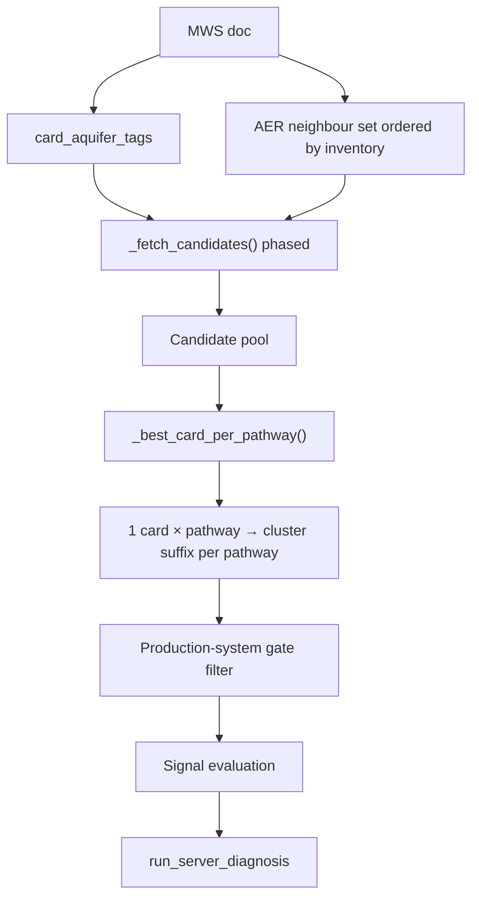
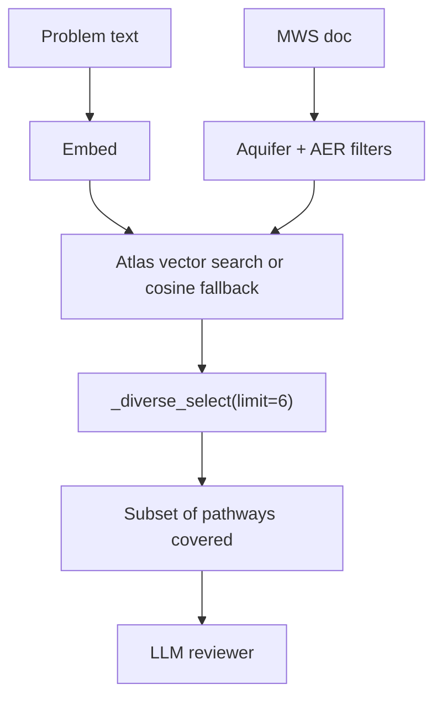

# Aquifer taxonomy and MWS → cluster matching

> **Status:** Reference documentation  
> **Created:** 2026-06-20  
> **Related:** [12-aer-retrieval-neighbors.md](./12-aer-retrieval-neighbors.md) (AER neighbour table and matrix export), [14-reingest-tuning-and-query-eval.md](./14-reingest-tuning-and-query-eval.md) (query eval workflow)

This document explains how **four aquifer vocabularies** relate to each other, and how an MWS is matched to **context clusters** (suffix `001`–`017` on evidence `card_id`) under each **execution mode**.

---

## Part 1 — Aquifer taxonomy mapping

Evidence cards, MWS exports, and signal expressions use different but related aquifer labels. Retrieval bridges them at runtime; signal evaluation uses the MWS export vocabulary.

### Four vocabularies

| # | Vocabulary | Where it lives | Values | Used for |
|---|------------|----------------|--------|----------|
| 1 | **Card / cluster aquifer tags** | `aquifer_tags` on Mongo evidence cards; `aquifer_types` in `metadata/context_clusters.json` | `hard_rock`, `alluvium`, `semi-consolidated`, `coastal` | Mongo pre-filter; cluster eligibility in matrix export |
| 2 | **ACWADAM class** | `mws_data.aquifer.acwadam_class`; export field `aquifer_class` in `data/raw_jsons/*.json` | `alluvium`, `himalayan_and_sub_himalayan`, `volcanic`, `sedimentary_soft_rock`, `sedimentary_hard_rock`, `crystalline_basement` | Lithology inference; **signal expression variables** (`aquifer_class == "volcanic"`, etc.) |
| 3 | **Dominant lithology** | `aquifer.lithology_percent` (NBSS names); export `aquifer_lithology_percent` | `Basalt`, `Granite`, `Alluvium`, `Sandstone`, … (15 columns in `LITHOLOGY_COLUMNS`) | Input to ACWADAM inference |
| 4 | **Raw Excel label** | `aquifer.raw_class`; export `aquifer_raw_class` | `"Hard Rock"`, `"Alluvium"`, … | Display / provenance only — **not** used in retrieval or signals |

**Code:** `runtime/services/aquifer_classification.py`, card stamping in `scripts/generate_evidence_cards.py` → `enrich_for_storage()`.

### How clusters get their aquifer tags

When cards are generated, each card is stamped from its **CONTEXT_CLUSTER** row:

```python
doc["aer_tags"] = cluster["aer_tags"]
doc["aquifer_tags"] = cluster["aquifer_types"]
doc["context_cluster"] = cluster["label"]
```

Cluster definitions: `metadata/context_clusters.json` (17 clusters, suffix `001`–`017`).  
Example: cluster `001` (Deccan basalt semi-arid) → `aquifer_types: ["hard_rock"]`, `aer_tags: ["AER-3", "AER-6"]`.

The **`__NNN` suffix** on `card_id` (e.g. `agriculture__water_scarcity__groundwater_stress__006`) is the cluster id. Runtime and eval code parse it from `card_id`; some API payloads also expose `cluster_suffix`.

### Lithology → ACWADAM inference

```
dominant lithology (NBSS %)  +  optional AER disambiguation
         ↓
   infer_acwadam_class()
         ↓
   acwadam_class  (6 classes)
```

**Lithology map** (`LITHOLOGY_TO_ACWADAM`): e.g. `Basalt → volcanic`, `Granite/Gneiss/Schist → crystalline_basement`, `Sandstone/Shale/Limestone → sedimentary_soft_rock`.

**AER overrides** when lithology is ambiguous or tied:

| Condition | Effect |
|-----------|--------|
| Himalayan AERs (1, 14, 16) + certain lithologies | `himalayan_and_sub_himalayan` |
| Deccan volcanic AERs (5, 6) | `volcanic` |
| Peninsular AERs (3, 7, 8, 11, 12) | `crystalline_basement` |
| Coastal alluvial AERs (18, 19, 20) | `alluvium` |
| No lithology / tie | `AER_FALLBACK_ACWADAM[aer]` |

Stored on each MWS as `mws_data.aquifer` via `build_aquifer_payload()` during ingest/export.

### ACWADAM → card aquifer filter (retrieval bridge)

`card_aquifer_tags(acwadam_class, aer_code)` maps MWS hydrogeology to Mongo `aquifer_tags`:

| ACWADAM class | Default card tag |
|---------------|------------------|
| `alluvium` | `alluvium` |
| `sedimentary_soft_rock` | `semi-consolidated` |
| `volcanic`, `crystalline_basement`, `sedimentary_hard_rock`, `himalayan_and_sub_himalayan` | `hard_rock` |

**AER coastal overrides:**

| AER | Condition | Card filter |
|-----|-----------|-------------|
| `AER-20` | any | `["coastal"]` |
| `AER-18` | `acwadam == alluvium` | `["coastal", "alluvium"]` |

Entry point for runtime: `card_aquifer_tags_for_mws(mws_doc)`.

### Fractional aquifer similarity (fallback retrieval)

When no cards match **exact** MWS aquifer tags within the AER set, `_fetch_candidates()` expands to **similar** card aquifer tags before widening geography.

Similarity matrix (`CARD_AQUIFER_TAG_SIMILARITY`):

| MWS tag → card tag | hard_rock | semi-consolidated | alluvium | coastal |
|--------------------|-----------|-------------------|----------|---------|
| **hard_rock** | 1.0 | 0.75 | 0.0 | 0.25 |
| **semi-consolidated** | 0.75 | 1.0 | 0.1 | 0.2 |
| **alluvium** | 0.0 | 0.1 | 1.0 | 0.7 |
| **coastal** | 0.25 | 0.2 | 0.7 | 1.0 |

**Design intent:** hard_rock ↔ semi-consolidated is a plausible hydrogeological proxy; hard_rock ↔ alluvium is **not** (cross-family matches eliminated in post-fix analysis).

Among cards for the same pathway, `_card_scope_score()` ranks: **(1) direct AER match**, **(2) aquifer similarity × 100**, **(3) card_id** (stable tie-break).

### What eval sees vs what retrieval uses

| Field in eval / UI | Vocabulary | Notes |
|--------------------|------------|-------|
| `mws_variable_summary.aquifer_class` | ACWADAM (6 classes) | Actual MWS hydrogeology |
| Card prose / thresholds | Cluster context | May describe neighbour cluster aquifer |
| `similarity_context` (eval payload) | Narrative bridge | Explains cluster match; softens D3 cluster wording only — **not** an EF3 exemption for aquifer |

Signal expressions on cards evaluate against **`aquifer_class`** (ACWADAM), not card `aquifer_tags`. A mismatch between cluster prose (“hard rock Deccan”) and MWS `aquifer_class: volcanic` is expected when neighbour cards are used; retrieval tries to minimise this via phased fetch + similarity ranking.

---

## Part 2 — MWS → cluster matching by execution mode

**Context cluster** = the `__NNN` suffix on the selected evidence card for a pathway. An MWS does not have a single stored cluster id in Mongo for diagnosis; cluster assignment is **computed per request** from lithology + AER + card inventory (except `clusters.tif` / matrix export — see §2.7).

All modes share the same **first steps**:

```
MWS doc
  ├─ nbss_lup_aer_code          → dominant AER (point-in-polygon)
  ├─ aquifer.lithology_percent  → infer acwadam_class
  └─ card_aquifer_tags_for_mws  → Mongo aquifer_tags filter
         +
  _aer_tags_for_retrieval()     → [MWS AER, neighbours…] ordered by aquifer inventory
         ↓
  _fetch_candidates()           → phased aquifer × AER pool (see §2.3)
         ↓
  mode-specific selection       → which cards / clusters
```

### 2.1 Server-only diagnosis (`want_llm_opinion: false`)

**When:** Default UI/API diagnosis; query eval **Q000** and per-query **server** eval mode; triage app.

| | |
|---|---|
| **Entry** | `load_mws_scoped_evidence_cards()` → `POST /api/query` (`runtime/routers/query.py`) |
| **Embedding** | None |
| **Selection** | `_best_card_per_pathway()` — **one card per `causal_pathway`** |
| **Rank key** | Direct AER on card → aquifer similarity → `card_id` |
| **Typical output** | ~8 cards (one per framework pathway), each with a cluster suffix |
| **Diagnosis** | `run_server_diagnosis()` — rule/signal evaluation only |
| **User question** | Ignored for retrieval (empty problem → same card pool) |



**Cluster implication:** The MWS may resolve to **different cluster suffixes per pathway** (e.g. groundwater_stress=`006`, drought=`003`) when the card inventory splits across clusters within the filtered pool.

### 2.2 LLM reviewer diagnosis (`want_llm_opinion: true`)

**When:** Dual-opinion UI toggle; query eval **`llm_ollama`** / **`llm_claude`** modes.

| | |
|---|---|
| **Entry** | `retrieve_evidence_cards()` |
| **Embedding** | Ollama embed of retrieval query (user problem, or default probe if empty) |
| **Pre-filter** | Same `_fetch_candidates()` / vector-search phases as server |
| **Selection** | Up to **6** cards via `_diverse_select()` — favours diversity across `production_system` and `causal_pathway` |
| **Score** | Vector similarity + `DIRECT_AER_MATCH_WEIGHT` (+0.06) if card lists MWS AER |
| **Diagnosis** | `run_llm_reviewer_diagnosis()` |
| **Citations** | Paper chunks attached per selected card |



**Cluster implication:** Only pathways with a retrieved card get cluster context; others may stay uncertain. Cluster suffixes are a **property of chosen cards**, not a single MWS label.

### 2.3 Shared candidate fetch — phased fallback

`_fetch_candidates()` (both modes) tries filters **in order** until the pool is non-empty:

1. **Exact aquifer + direct MWS AER** (`aer_tags == mws_aer`)
2. **Similar aquifer + direct MWS AER** (expanded tags from similarity matrix)
3. **Exact aquifer + full AER neighbour set**
4. **Similar aquifer + full AER neighbour set**
5. **Exact aquifer, any AER** (drop AER constraint)
6. **Similar aquifer, any AER**
7. **AER-only last resort** (same neighbour set, aquifer filter dropped)

Vector search (`retrieve_evidence_cards`) mirrors the same phase order via `_vector_search_scored()`.

**AER neighbour ordering:** After building `[mws_aer, …neighbours]`, `_order_aer_tags_by_aquifer_inventory()` demotes neighbours whose card inventory lacks same/similar aquifer tags. AER-11/12 keep AER-10 at the **end** of the static list as a weak sedimentary proxy.

Full neighbour table and rationale: [12-aer-retrieval-neighbors.md](./12-aer-retrieval-neighbors.md).

### 2.4 Follow-up turns (frozen cards)

**When:** `POST /api/query/follow-up` with existing `session_id`.

| | |
|---|---|
| **Retrieval** | **Skipped** — reloads `frozen_card_ids` from turn 0 via `load_evidence_cards_by_ids()` |
| **Cluster** | Fixed to initial turn’s cards (server or LLM path) |
| **Re-eval** | Signals re-run on same cards; user answers may inject variables |

Aquifer/AER filters are **not** re-applied on follow-ups unless the session is restarted.

### 2.5 Query eval batch modes

**Script:** `scripts/eval/run_query_eval.py`

| Mode | Diagnosis run | `want_llm_opinion` | Eval artifact | Cluster matching |
|------|---------------|--------------------|---------------|------------------|
| **server** (Q000 baseline) | Once per case study, empty problem | `false` | `*_server_eval.json` | Full server path — all pathways |
| **llm_ollama** | Per query | `true`, provider ollama | `*_llm_ollama_eval.json` | LLM retrieval — up to 6 diverse cards |
| **llm_claude** | Per query | `true`, provider anthropic | `*_llm_claude_eval.json` | Same as ollama, different reviewer model |
| **server_plus_llm_ollama** | No extra run | — (evaluates ollama diagnosis) | `*_server_plus_llm_ollama_eval.json` | Eval prompt: apply `similarity_context` caveat like server |

**Eval payload extras (server modes):**

- `similarity_context` — built by `build_similarity_context_line()` listing matched cluster labels + MWS `aquifer_class`
- `_eval_note` — monsoon derived-variable guidance
- `postprocess_evaluation_result()` — strips **monsoon-only** stale EF3 flags in server mode (not aquifer)

**Aquifer mismatch analysis:** `scripts/eval/analyze_aquifer_cluster_mismatch.py` simulates server path across all MWS; report e.g. `reports/aquifer_cluster_mismatch_post_retriever_fix.json`.

### 2.6 Triage app

**Code:** `runtime/services/triage_card_map.py`

Uses **`load_mws_scoped_evidence_cards()`** — identical pool to server-only diagnosis. Returns `cards_by_pathway` with `card_id`, `cluster_suffix`, `aer_tags` for reviewer UI.

### 2.7 Matrix export and `clusters.tif` (reference, not runtime)

These tools **simulate** server-only matching offline; diagnosis at runtime always goes through `retriever.py`.

| Artifact | Script | Purpose |
|----------|--------|---------|
| `data/reports/aquifer_aer_cluster_matrix.csv` | `scripts/maintenance/export_aquifer_aer_cluster_matrix.py` | 300 rows = 15 lithologies × 20 AERs; records eligible clusters + `non_llm_resolved_cluster_suffix` |
| `data/reports/aquifer_aer_cluster_gaps.json` | same | Pairs with no eligible cluster or multiple clusters |
| `data/clusters.tif` | external GIS build from matrix | Raster values 1–17 → cluster suffix; used in signal editor / map click lookup (`CLUSTER_COG_URL`) |

**Runtime diagnosis does not read `clusters.tif`** for card selection. The raster is the geographic face of the matrix; per-pathway server retrieval may still assign mixed suffixes when the matrix row would show `mixed`.

### 2.8 Production-system gating (post-retrieval filter)

After cards are selected (any mode), `evaluate_production_system_gates()` may remove cards/pathways whose production system is ineligible for the MWS (e.g. no forest area → skip NTFP cards). This can leave fewer pathways with cluster assignments than the raw retriever output.

**Code:** `runtime/services/production_system_gate.py`, called from `query.py` before bundle assembly.

---

## Part 3 — UI alignment labels (AER, not aquifer)

After cards are chosen, the frontend shows AER alignment per pathway (`runtime/services/aer_alignment.py`, `frontend/src/utils/pathwayLabels.ts`):

| Label | Condition |
|-------|-----------|
| **exact** | MWS AER ∈ card `aer_tags` |
| **neighbor** | MWS AER ∉ card tags, but card tags ∩ `retrieval_aer_tags` ≠ ∅ |
| **mismatch** | No overlap with retrieval set |

Aquifer alignment is **not** a separate UI label; it affects fetch phase and `_card_scope_score` only.

---

## Part 4 — EF3 exceptions (eval only)

EF3 (“wrong direction of inference”) is defined in `scripts/reference/evaluation_rubric.json`. Exceptions wired outside the rubric JSON:

| Location | Exception |
|----------|-----------|
| Rubric EF3 `check` | Do not flag `monsoon_onset_date` missing when `monsoon_onset_date_series` or `monsoon_onset_delay_*` present |
| `rubric_evaluator._eval_note` | Monsoon derived-variable guidance in eval prompt |
| Server / `server_plus_llm_ollama` mode note | D3 soft caveat via `similarity_context` (cluster prose vs MWS aquifer) |
| `postprocess_evaluation_result()` | Strip monsoon “missing/unresolved” EF3 in server mode only |
| Diagnosis runtime | **No EF3 logic** |

Aquifer cluster mismatch is **not** an EF3 exemption (removed after retriever fix); remaining aquifer-related eval noise should be addressed via better card matching, not eval leniency.

---

## Part 5 — Quick reference: mode comparison

| Aspect | Server-only | LLM reviewer | Follow-up | Triage | Matrix / raster |
|--------|-------------|--------------|-----------|--------|-----------------|
| Function | `load_mws_scoped_evidence_cards` | `retrieve_evidence_cards` | `load_evidence_cards_by_ids` | `resolve_cards_for_mws` | `export_aquifer_aer_cluster_matrix` |
| Cards | 1 × pathway | ≤ 6 diverse | Frozen from turn 0 | 1 × pathway | Simulated server |
| Cluster | Per pathway suffix | Per retrieved card | Fixed | Per pathway suffix | Single preferred / mixed |
| Embed | No | Yes | No | No | No |
| Problem text | Ignored | Drives ranking | From turn 0 | N/A | N/A |

---

## Maintenance checklist

After changing evidence cards, neighbour table, or aquifer inference:

1. Regenerate matrix: `python scripts/maintenance/export_aquifer_aer_cluster_matrix.py`
2. Reload affected cards to Mongo: `python scripts/reload_evidence_cards.py --prefix …`
3. Run retriever tests: `python -m pytest scripts/test/test_retriever_aer.py`
4. Optional full mismatch scan: `python scripts/eval/analyze_aquifer_cluster_mismatch.py`
5. Update [12-aer-retrieval-neighbors.md](./12-aer-retrieval-neighbors.md) if neighbour **table** changes; update **this doc** if aquifer bridge or fetch phases change

---

## Key source files

| Topic | Path |
|-------|------|
| ACWADAM inference + card filter + similarity | `runtime/services/aquifer_classification.py` |
| Retrieval + phased fetch + scoring | `runtime/services/retriever.py` |
| Query routing (mode switch) | `runtime/routers/query.py` |
| Cluster definitions | `metadata/context_clusters.json` |
| Card stamping | `scripts/generate_evidence_cards.py` |
| Eval similarity context + EF3 postprocess | `scripts/eval/rubric_evaluator.py` |
| Triage card map | `runtime/services/triage_card_map.py` |
| AER alignment labels | `runtime/services/aer_alignment.py` |
